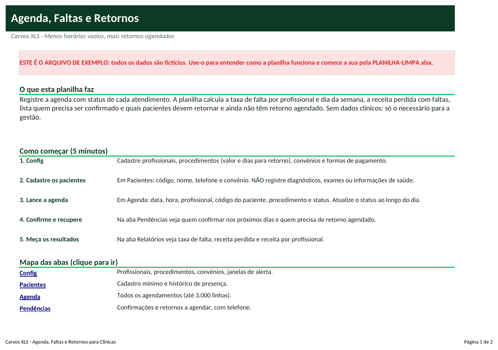
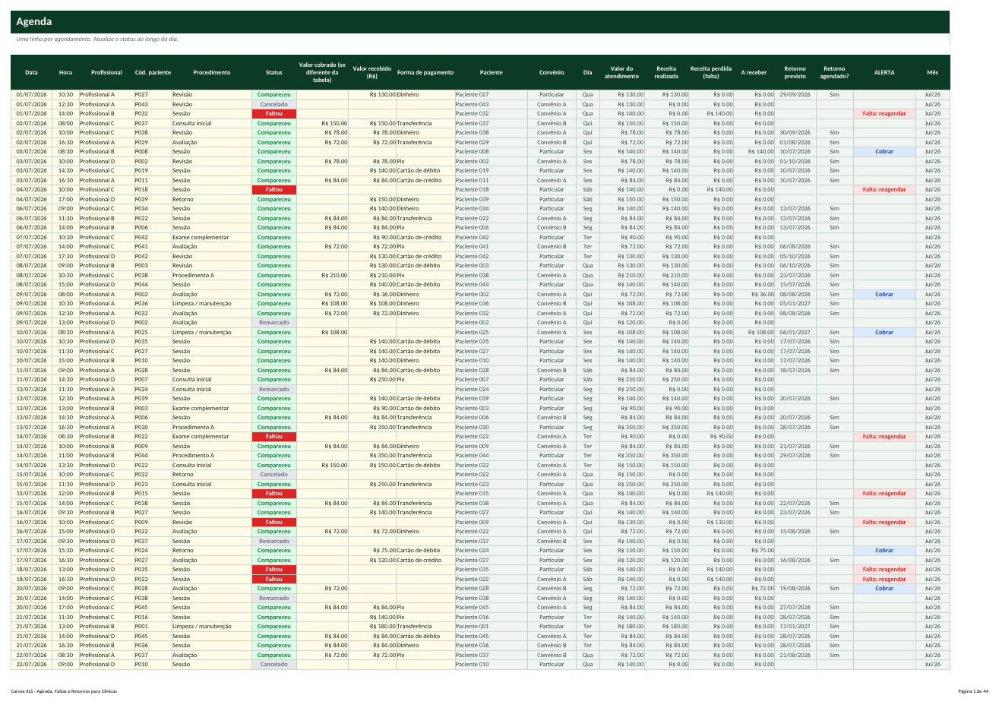
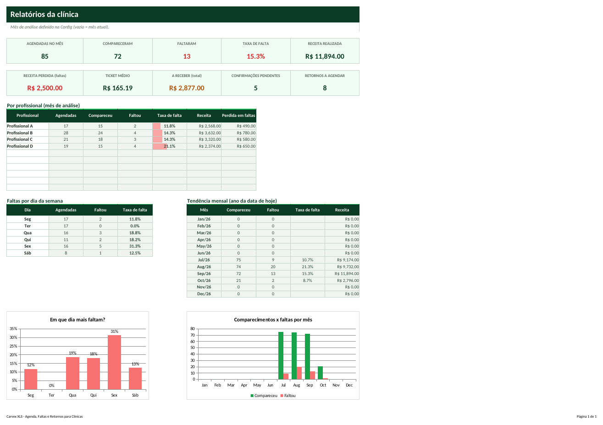

# Tutorial — Agenda, Faltas e Retornos para Clínicas

> Leia na ordem. Em 20 minutos você terá a planilha funcionando com os seus dados.

## 1. Para que serve?
- Organizar a agenda com status (agendado, confirmado, compareceu, faltou, cancelado, remarcado).
- Mostrar quem precisa ser confirmado e quais pacientes precisam de retorno agendado.
- Medir a taxa de faltas e a receita perdida por profissional e por dia da semana.

## 2. Para quem serve?
- Consultórios e clínicas (odonto, fisioterapia, psicologia, estética)
- Clínicas de nutrição e pilates
- Espaços com agenda por profissional
- Qualquer serviço com hora marcada

## 3. O que você precisa antes de começar?
Separe estas informações (leva cerca de 15 minutos):
- Lista de profissionais.
- Lista de procedimentos com valor e prazo de retorno (dias).
- Convênios atendidos.
- Cadastro mínimo de pacientes (nome, telefone, convênio), sem informações de saúde.

## 4. Como abrir a planilha
1. Abra o arquivo **`PLANILHA-LIMPA.xlsx`** no Excel (ou LibreOffice).
2. Se aparecer a faixa amarela *Modo de Exibição Protegido*, clique em **Habilitar Edição**.
3. Clique em **Arquivo → Salvar como** e salve uma cópia com o nome da sua empresa (ex.: `Agenda,-MinhaEmpresa.xlsx`). **Nunca trabalhe no arquivo original**: ele é a sua cópia de segurança.
4. Na primeira aba (**Início**) leia o resumo e veja o mapa das abas (clique nos nomes para navegar).
5. Quer ver tudo funcionando antes? Abra **`EXEMPLO.xlsx`** (dados fictícios) e compare com a sua.

**Legenda de cores:** células **amarelas** = você preenche; células **cinza** = cálculo automático (não digite); cabeçalhos **verde-escuro** = títulos de coluna.

## 5. Primeiro passo — Configure e cadastre
1. Abra **Config**: **C6** (confirmar agendamentos com até X dias), **C7** (alertar retornos que vencem em X dias) e, se quiser, **C8** o mês de análise (vazio = mês atual).
2. Cadastre profissionais (**E5:E14**) e procedimentos com **valor** e **dias para retorno** (**G5:I34**; use 0 para sem retorno), convênios e formas de pagamento.
3. Abra **Pacientes** e cadastre **Código**, **Nome**, **Telefone** e **Convênio**. Não registre informações de saúde.

## 6. Segundo passo — Lance a agenda
1. Abra **Agenda**: **Data**, **Hora**, **Profissional**, **Cód. paciente** (lista), **Procedimento** e **Status**.
2. Atualize o status durante o dia: Confirmado, Compareceu, Faltou, Cancelado ou Remarcado.
3. Para convênio ou desconto, digite o valor na coluna **Valor cobrado**; ao receber, preencha **Valor recebido** e a **Forma de pagamento**.
4. A coluna **ALERTA** indica CONFIRMAR, Atualizar status, Cobrar ou 'Falta: reagendar'.

## 7. Terceiro passo — Confirme, recupere retornos e meça
1. Abra **Pendências**: à esquerda quem **confirmar** nos próximos dias; à direita os **retornos a agendar** (com telefone).
2. Abra **Relatórios**: agendadas, compareceram, faltaram, **taxa de falta**, **receita realizada** e **receita perdida em faltas**.
3. Veja a taxa de falta por profissional e por **dia da semana** para decidir onde reforçar a confirmação ou aplicar overbooking responsável.

## 8. Como interpretar os resultados
| Indicador | Como ler |
|---|---|
| **Taxa de falta** | Faltou ÷ (compareceu + faltou). Cancelamentos e remarcações não entram. |
| **Receita perdida** | Valor dos atendimentos marcados como 'Faltou'. |
| **Ticket médio** | Receita realizada ÷ comparecimentos. |
| **Confirmações pendentes** | Agendamentos 'Agendado' dentro da janela de dias da Config. |
| **Retornos a agendar** | Pacientes atendidos cujo retorno previsto vence (ou venceu há até 60 dias) e não há consulta futura. |
| **A receber** | Atendimentos realizados com valor recebido menor que o valor do atendimento. |

## 9. Exemplo prático
Clínica fictícia com 4 profissionais, 46 pacientes e 8 procedimentos; agenda de julho a outubro de 2026; mês de análise: setembro de 2026; hoje = 08/10/2026.

- Setembro: **85** agendadas, **72** compareceram e **13** faltaram: taxa de falta de **15,3%**, o que representou **R$ 2.500,00** de receita perdida.
- Receita realizada: **R$ 11.894,00** (ticket médio **R$ 165,19**); a receber: **R$ 2.877,00**.
- Pendências hoje: **5** confirmações e **8** retornos a agendar. No gráfico por dia da semana, a sexta-feira tem a maior taxa de falta.

*(Todos os dados do `EXEMPLO.xlsx` são fictícios e não representam pessoas ou empresas reais.)*

## 10. Como atualizar
**Diariamente**
- Confirme os agendamentos de amanhã (aba Pendências).
- Atualize os status do dia e registre os recebimentos.

**Semanalmente**
- Ligue para pacientes de retorno vencendo.
- Veja a taxa de falta da semana por profissional.

**Mensalmente**
- Compare taxa de falta com o mês anterior.
- Reavalie horários e política de cancelamento.
- Revise valores dos procedimentos.

## 11. Erros comuns
1. Deixar agendamentos passados como 'Agendado'
2. Contar cancelamento como falta
3. Código de paciente repetido
4. Registrar dados de saúde no campo de observação
5. Esquecer o prazo de retorno do procedimento

## 12. Como corrigir
1. **Deixar agendamentos passados como 'Agendado'** → O alerta 'Atualizar status' avisa; sem corrigir, faltas e receita saem errados.
2. **Contar cancelamento como falta** → Use 'Cancelado' ou 'Remarcado' quando o paciente avisou; só 'Faltou' sem aviso.
3. **Código de paciente repetido** → A validação bloqueia códigos repetidos.
4. **Registrar dados de saúde no campo de observação** → Não faça isso: use apenas observações administrativas (LGPD).
5. **Esquecer o prazo de retorno do procedimento** → Sem os dias de retorno na Config, o paciente não entra na fila de retornos.

Se aparecer algo estranho (células vazias onde deveria haver número), confira: (a) a data de hoje na aba Config, (b) se os nomes (códigos, etapas, clientes) foram escolhidos pela lista suspensa e (c) se você digitou nas células **cinza**. Para restaurar uma fórmula apagada por engano, copie a mesma célula do `EXEMPLO.xlsx`.

## 13. Perguntas frequentes
**A planilha envia lembretes?**  Não; ela lista quem precisa ser confirmado, com telefone, para você enviar por WhatsApp.

**Posso registrar prontuário?**  Não. A planilha é só de gestão; prontuário exige sistema próprio e regras de sigilo.

**Funciona para convênios?**  Sim: informe o valor do convênio na coluna Valor cobrado e acompanhe a receita por paciente e convênio.

**O que é 'Retornos a agendar'?**  Pacientes que compareceram a um procedimento com prazo de retorno e ainda não têm consulta futura marcada.

**Quantos agendamentos cabem?**  3.000 linhas de agenda e 1.000 pacientes.
