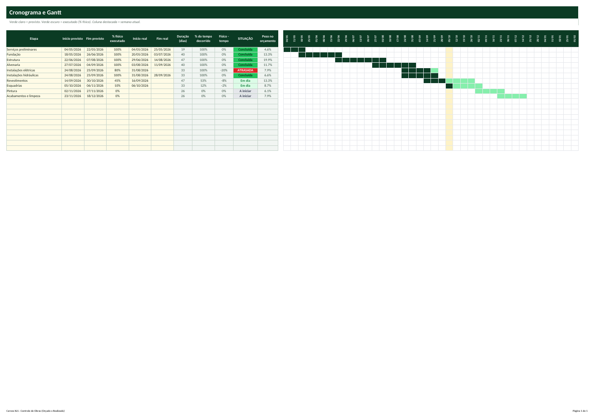
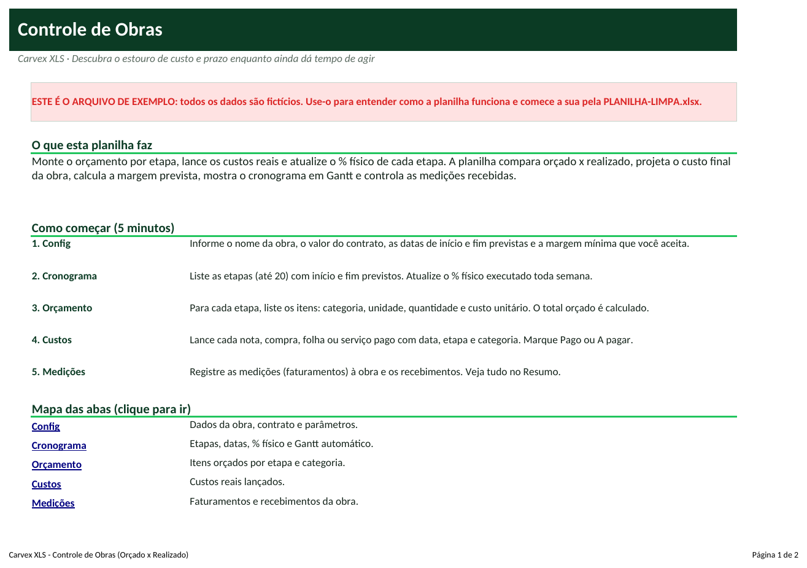
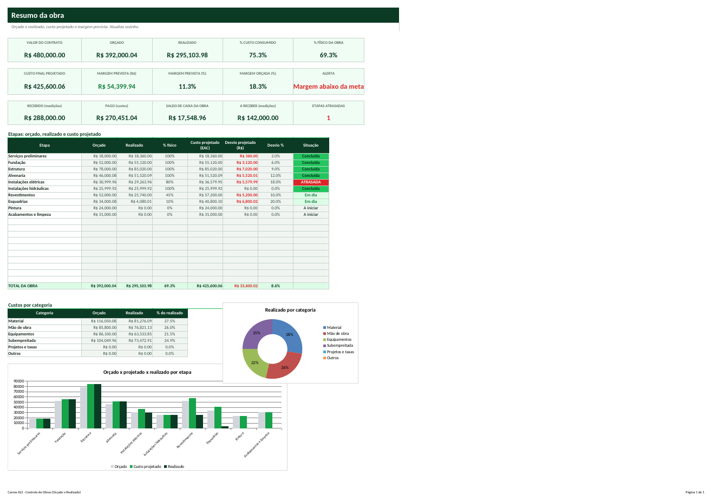

# Tutorial — Controle de Obras (Orçado x Realizado)

> Leia na ordem. Em 20 minutos você terá a planilha funcionando com os seus dados.

## 1. Para que serve?
- Comparar o orçado com o realizado por etapa e por categoria de custo.
- Projetar o custo final da obra (custo real ÷ % físico) e a margem prevista em relação ao contrato.
- Acompanhar o cronograma em Gantt, as etapas atrasadas e o caixa da obra (recebido x pago).

## 2. Para quem serve?
- Pequenas construtoras e empreiteiras
- Engenheiros e arquitetos que gerenciam obra
- Empresas de reforma e manutenção predial
- Quem constrói por administração e precisa prestar contas

## 3. O que você precisa antes de começar?
Separe estas informações (leva cerca de 15 minutos):
- Valor do contrato (ou preço de venda).
- Orçamento detalhado por etapa (itens, quantidades e custos unitários).
- Cronograma: início e fim previstos de cada etapa.
- Notas e pagamentos já feitos.
- Medições emitidas e recebidas.

## 4. Como abrir a planilha
1. Abra o arquivo **`PLANILHA-LIMPA.xlsx`** no Excel (ou LibreOffice).
2. Se aparecer a faixa amarela *Modo de Exibição Protegido*, clique em **Habilitar Edição**.
3. Clique em **Arquivo → Salvar como** e salve uma cópia com o nome da sua empresa (ex.: `Controle-MinhaEmpresa.xlsx`). **Nunca trabalhe no arquivo original**: ele é a sua cópia de segurança.
4. Na primeira aba (**Início**) leia o resumo e veja o mapa das abas (clique nos nomes para navegar).
5. Quer ver tudo funcionando antes? Abra **`EXEMPLO.xlsx`** (dados fictícios) e compare com a sua.

**Legenda de cores:** células **amarelas** = você preenche; células **cinza** = cálculo automático (não digite); cabeçalhos **verde-escuro** = títulos de coluna.

## 5. Primeiro passo — Cadastre a obra e as etapas
1. Abra **Config** e preencha: **C4** obra, **C5** cliente, **C6** valor do contrato, **C7** início e **C8** fim previstos e **C9** margem mínima aceitável.
2. Abra **Cronograma** e liste até 20 etapas em **A5:A24** com **Início previsto** e **Fim previsto** (colunas B e C).
3. O Gantt semanal aparece automaticamente à direita (verde claro = previsto; verde escuro = executado).

## 6. Segundo passo — Monte o orçamento e lance os custos
1. Abra **Orçamento** e, para cada etapa (lista), informe **Item**, **Categoria**, **Un.**, **Quantidade** e **Custo unitário**. O total orçado é calculado.
2. Abra **Custos** e lance cada nota/pagamento: **Data**, **Etapa**, **Categoria**, **Fornecedor**, **Descrição**, **Valor** e **Status** (Pago ou A pagar).
3. Abra **Medições** e registre cada faturamento: número, data, valor, vencimento; ao receber, data e valor recebido.

## 7. Terceiro passo — Atualize o % físico e leia o Resumo
1. Toda semana abra **Cronograma** e atualize o **% físico executado** (coluna D) de cada etapa.
2. Abra **Resumo**: veja orçado, realizado, % custo consumido x % físico, **custo final projetado (EAC)** e **margem prevista**.
3. O quadro por etapa mostra o desvio projetado em R$ e a situação do cronograma (Concluída, Em dia, ATRASADA, A iniciar). O alerta indica se a margem está abaixo da meta.

## 8. Como interpretar os resultados
| Indicador | Como ler |
|---|---|
| **% custo consumido** | Realizado ÷ orçado. Comparar com o % físico: custo consumindo mais que o avanço = alerta. |
| **Custo projetado (EAC)** | Custo real ÷ % físico de cada etapa (ou o orçado se o avanço é menor que 5%). |
| **Margem prevista** | Contrato - custo projetado. Compare com a margem orçada e a meta. |
| **Desvio projetado** | Custo projetado - orçado da etapa. Positivo (vermelho) = estouro. |
| **Situação da etapa** | ATRASADA se o % físico está mais de 10 pontos abaixo do % de tempo decorrido. |
| **Saldo de caixa da obra** | Recebido das medições - custos pagos. |

## 9. Exemplo prático
Reforma comercial fictícia de R$ 480.000,00, de 04/05/2026 a 18/12/2026, com 10 etapas; hoje = 08/10/2026.

- Orçado: **R$ 392.000,04**; realizado: **R$ 295.103,98** (**75,3%** do orçado) com **69,3%** de avanço físico.
- Custo final projetado: **R$ 425.600,06** → margem prevista **R$ 54.399,94** (**11,3%**) contra margem orçada de **18,3%**: alerta **Margem abaixo da meta**.
- Recebido: **R$ 288.000,00**; pago: **R$ 270.451,04**; saldo de caixa: **R$ 17.548,96**; a receber: **R$ 142.000,00**; etapas atrasadas: **1**.

*(Todos os dados do `EXEMPLO.xlsx` são fictícios e não representam pessoas ou empresas reais.)*

## 10. Como atualizar
**Diariamente**
- Lance os custos e notas do dia (ou da semana).

**Semanalmente**
- Atualize o % físico de cada etapa.
- Revise etapas ATRASADAS e desvios projetados.

**Mensalmente**
- Emita a medição e lance o recebimento.
- Compare margem prevista x orçada e decida correções (renegociar, trocar fornecedor, reforçar equipe).
- Reprograme etapas atrasadas no cronograma.

## 11. Erros comuns
1. Nome de etapa diferente nas abas
2. Não atualizar o % físico
3. Lançar adiantamentos como custo total
4. Esquecer custos indiretos
5. Data de início da obra em branco

## 12. Como corrigir
1. **Nome de etapa diferente nas abas** → Use a lista suspensa. A aba Custos mostra 'Etapa inválida' quando não bate.
2. **Não atualizar o % físico** → A projeção do custo final depende dele; sem atualizar, o EAC fica irreal.
3. **Lançar adiantamentos como custo total** → Lance o valor efetivamente consumido da etapa para não distorcer a projeção.
4. **Esquecer custos indiretos** → Crie uma etapa 'Administração da obra' para equipe, canteiro e taxas.
5. **Data de início da obra em branco** → O Gantt precisa do início da Config para montar as semanas.

Se aparecer algo estranho (células vazias onde deveria haver número), confira: (a) a data de hoje na aba Config, (b) se os nomes (códigos, etapas, clientes) foram escolhidos pela lista suspensa e (c) se você digitou nas células **cinza**. Para restaurar uma fórmula apagada por engano, copie a mesma célula do `EXEMPLO.xlsx`.

## 13. Perguntas frequentes
**Dá para usar para vários contratos?**  Use uma cópia da planilha por obra.

**Serve para reforma pequena?**  Sim; use poucas etapas (ex.: demolição, elétrica, acabamento).

**O Gantt precisa de macros?**  Não: é feito com formatação condicional, funciona em Excel e LibreOffice.

**A projeção é exata?**  É uma estimativa baseada no avanço físico; revise com o engenheiro responsável.

**Quantas etapas e itens?**  20 etapas, 300 itens de orçamento, 1.500 custos e 60 medições.
