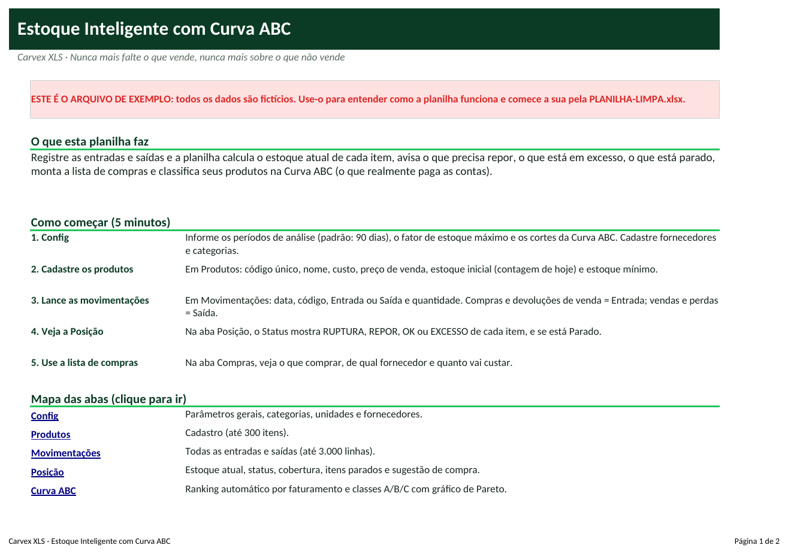
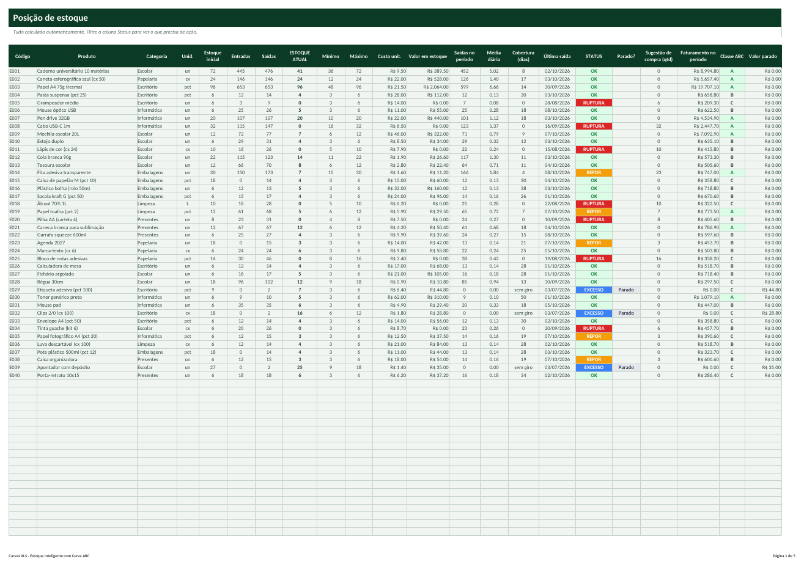
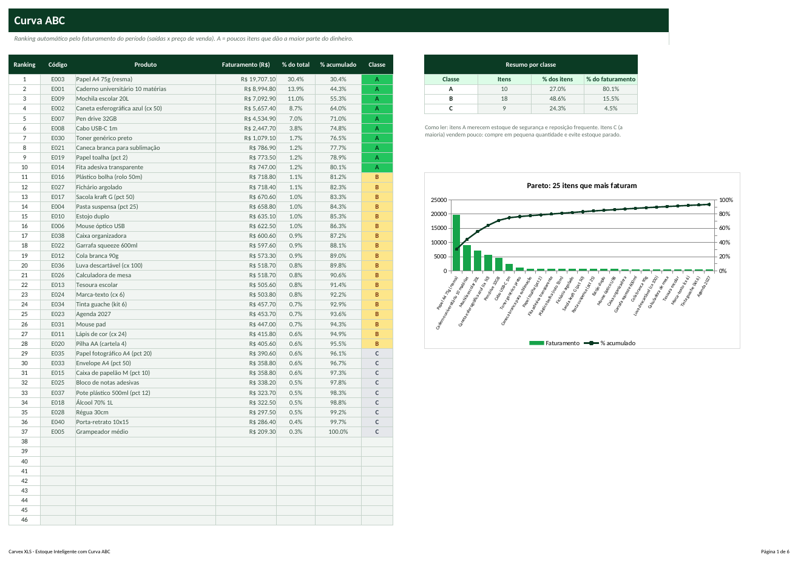

# Tutorial — Estoque Inteligente com Curva ABC

> Leia na ordem. Em 20 minutos você terá a planilha funcionando com os seus dados.

## 1. Para que serve?
- Saber o estoque atual de cada item sem contar prateleira.
- Ser avisado do que precisa repor, do que está em excesso e do que está parado há meses.
- Montar a lista de compras e descobrir quais itens (classe A) pagam as contas da empresa.

## 2. Para quem serve?
- Lojas físicas e e-commerce
- Papelarias, farmácias, autopeças, mercadinhos
- Distribuidores pequenos
- Qualquer negócio que compra para revender

## 3. O que você precisa antes de começar?
Separe estas informações (leva cerca de 15 minutos):
- Lista de produtos com código, custo e preço de venda.
- Contagem física do estoque de hoje (será o estoque inicial).
- Estoque mínimo de cada item (quanto dura até o fornecedor entregar).
- Fornecedor principal de cada item e histórico de vendas, se existir.

## 4. Como abrir a planilha
1. Abra o arquivo **`PLANILHA-LIMPA.xlsx`** no Excel (ou LibreOffice).
2. Se aparecer a faixa amarela *Modo de Exibição Protegido*, clique em **Habilitar Edição**.
3. Clique em **Arquivo → Salvar como** e salve uma cópia com o nome da sua empresa (ex.: `Estoque-MinhaEmpresa.xlsx`). **Nunca trabalhe no arquivo original**: ele é a sua cópia de segurança.
4. Na primeira aba (**Início**) leia o resumo e veja o mapa das abas (clique nos nomes para navegar).
5. Quer ver tudo funcionando antes? Abra **`EXEMPLO.xlsx`** (dados fictícios) e compare com a sua.

**Legenda de cores:** células **amarelas** = você preenche; células **cinza** = cálculo automático (não digite); cabeçalhos **verde-escuro** = títulos de coluna.

## 5. Primeiro passo — Configure e cadastre os produtos
1. Abra **Config**: em **C6** o período para medir vendas (padrão 90 dias), em **C7** os dias sem saída para considerar 'Parado', em **C8** o fator do estoque máximo (2 = dobro do mínimo).
2. Cadastre categorias (**E5:E34**), unidades (**F5:F34**) e fornecedores (**G5:G34**).
3. Abra **Produtos** e preencha: **Código** (único), Produto, Categoria, Unidade, Fornecedor, **Custo**, **Preço de venda**, **Estoque inicial** (contagem de hoje) e **Estoque mínimo**.

## 6. Segundo passo — Lance as movimentações
1. Abra **Movimentações**. Cada linha é um movimento: **Data**, **Código** (lista), **Tipo** (Entrada ou Saída) e **Quantidade**.
2. Entrada = compra, devolução de cliente. Saída = venda, perda, consumo interno.
3. Observação opcional: número da NF ou pedido.
4. A coluna **Alerta** deve mostrar OK; 'Código inválido' significa que o código não está em Produtos.

## 7. Terceiro passo — Leia a Posição, a Curva ABC e a lista de compras
1. Abra **Posição**: **ESTOQUE ATUAL** e **STATUS** (RUPTURA = zerado; REPOR = no mínimo ou abaixo; EXCESSO = acima do máximo; OK).
2. A coluna **Parado?** marca itens com estoque e sem saída há mais do período definido; **Valor parado** soma o dinheiro empatado.
3. Abra **Curva ABC**: classe A = poucos itens com ~80% do faturamento; B até 95%; C o resto.
4. Abra **Compras**: itens em RUPTURA/REPOR com fornecedor, quantidade sugerida e total em R$. Abra o **Dashboard** para o resumo.

## 8. Como interpretar os resultados
| Indicador | Como ler |
|---|---|
| **Estoque atual** | Estoque inicial + entradas - saídas. |
| **Cobertura (dias)** | Estoque atual ÷ média diária de saídas. Quantos dias o estoque dura. |
| **Valor em estoque** | Estoque atual x custo unitário. |
| **Dinheiro parado** | Valor em estoque dos itens sem saída há muito tempo. |
| **Classe A/B/C** | A = itens que mais faturam (prioridade); C = pouco faturamento (compre pouco). |
| **Compra sugerida** | Quantidade para chegar ao estoque máximo, x custo. |

## 9. Exemplo prático
Papelaria fictícia com 40 produtos e cerca de 700 movimentações entre julho e outubro de 2026.

- Valor em estoque: **R$ 5.485,50**. Itens em ruptura: **7**; para repor: **5**; em excesso: **3**.
- Itens parados: **3** somando **R$ 108,60** de dinheiro parado. Itens classe A: **10**.
- Lista de compras sugerida: **R$ 811,20** (itens em ruptura/reposição, até o estoque máximo).

*(Todos os dados do `EXEMPLO.xlsx` são fictícios e não representam pessoas ou empresas reais.)*

## 10. Como atualizar
**Diariamente**
- Lance as vendas e entradas do dia (ou use o fechamento do caixa).
- Confira a aba Compras antes de falar com fornecedores.

**Semanalmente**
- Revise itens em RUPTURA e REPOR.
- Faça contagem de uma categoria (inventário rotativo) e corrija diferenças com uma movimentação.

**Mensalmente**
- Veja a Curva ABC e os itens Parados: promoção, kit ou devolução ao fornecedor.
- Ajuste estoque mínimo dos itens classe A.

## 11. Erros comuns
1. Código diferente entre Produtos e Movimentações
2. Esquecer de lançar vendas
3. Estoque inicial errado
4. Estoque mínimo em branco
5. Esperar Curva ABC sem vendas

## 12. Como corrigir
1. **Código diferente entre Produtos e Movimentações** → Escolha o código pela lista suspensa. 'Código inválido' no Alerta indica o erro.
2. **Esquecer de lançar vendas** → O estoque só cai com lançamentos de Saída. Lance diariamente ou importe o relatório do caixa.
3. **Estoque inicial errado** → Faça a contagem física antes. Diferenças futuras podem ser ajustadas com uma Entrada/Saída com observação 'Ajuste de inventário'.
4. **Estoque mínimo em branco** → Sem mínimo o item nunca aparece como REPOR nem tem estoque máximo. Preencha o mínimo.
5. **Esperar Curva ABC sem vendas** → A classe depende das saídas dentro do período da Config; sem saídas todos viram C.

Se aparecer algo estranho (células vazias onde deveria haver número), confira: (a) a data de hoje na aba Config, (b) se os nomes (códigos, etapas, clientes) foram escolhidos pela lista suspensa e (c) se você digitou nas células **cinza**. Para restaurar uma fórmula apagada por engano, copie a mesma célula do `EXEMPLO.xlsx`.

## 13. Perguntas frequentes
**Dá para usar com código de barras?**  Sim, use o código de barras como Código do produto (texto ou número, mas sempre igual nas duas abas).

**Quantos produtos e movimentações?**  300 produtos e 3.000 movimentações. Para mais, mantenha uma cópia por semestre.

**O estoque máximo é calculado?**  Sim: estoque mínimo x fator da Config (padrão 2).

**Posso ter mais de um depósito?**  Não nesta versão; use uma cópia por depósito. Multi-depósito está planejado para a versão premium.

**Como a classe ABC é calculada?**  Faturamento do período = saídas x preço de venda (ou custo se não houver preço). Ordenado do maior ao menor; A até 80% acumulado, B até 95%.
