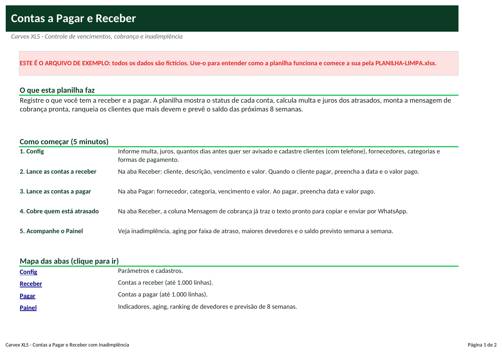
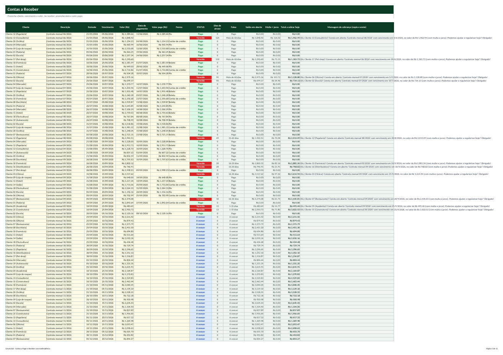
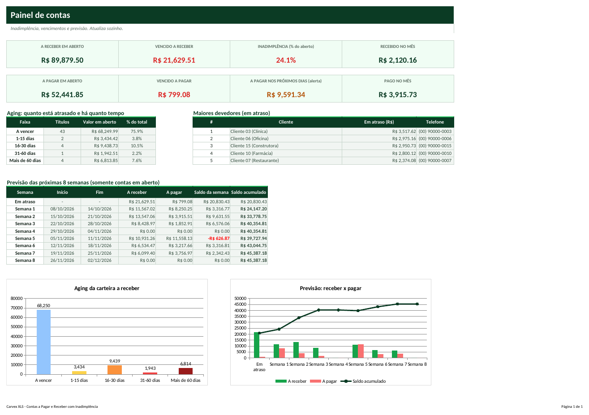

# Tutorial — Contas a Pagar e Receber com Inadimplência

> Leia na ordem. Em 20 minutos você terá a planilha funcionando com os seus dados.

## 1. Para que serve?
- Saber o que vence hoje, o que está vencido e quanto cada cliente deve.
- Calcular multa e juros dos atrasados e já ter o texto da cobrança pronto para enviar.
- Prever semana a semana quanto vai entrar e sair para não ser pego de surpresa.

## 2. Para quem serve?
- Prestadores de serviço com contratos mensais
- Escolas, academias e clínicas com mensalidades
- Distribuidores e lojas que vendem a prazo
- Qualquer empresa que paga fornecedores a prazo

## 3. O que você precisa antes de começar?
Separe estas informações (leva cerca de 15 minutos):
- Lista de contas a receber em aberto (cliente, vencimento, valor).
- Lista de contas a pagar em aberto (fornecedor, vencimento, valor).
- Percentual de multa e juros do seu contrato (comum: 2% e 1% ao mês).
- Telefone dos clientes (para a cobrança).

## 4. Como abrir a planilha
1. Abra o arquivo **`PLANILHA-LIMPA.xlsx`** no Excel (ou LibreOffice).
2. Se aparecer a faixa amarela *Modo de Exibição Protegido*, clique em **Habilitar Edição**.
3. Clique em **Arquivo → Salvar como** e salve uma cópia com o nome da sua empresa (ex.: `Contas-MinhaEmpresa.xlsx`). **Nunca trabalhe no arquivo original**: ele é a sua cópia de segurança.
4. Na primeira aba (**Início**) leia o resumo e veja o mapa das abas (clique nos nomes para navegar).
5. Quer ver tudo funcionando antes? Abra **`EXEMPLO.xlsx`** (dados fictícios) e compare com a sua.

**Legenda de cores:** células **amarelas** = você preenche; células **cinza** = cálculo automático (não digite); cabeçalhos **verde-escuro** = títulos de coluna.

## 5. Primeiro passo — Configure e cadastre clientes e fornecedores
1. Abra **Config**: **C6** multa (ex.: 2%), **C7** juros ao mês (ex.: 1%), **C8** dias de alerta para pagar (ex.: 7).
2. Cadastre clientes com telefone em **E5:F104** e fornecedores em **H5:H64**.
3. Ajuste categorias de despesa (**J5:J34**) e formas de pagamento (**L5:L16**).

## 6. Segundo passo — Lance receber e pagar
1. Abra **Receber**: preencha **Cliente** (lista), **Descrição**, **Emissão**, **Vencimento** e **Valor**.
2. Quando o cliente pagar, preencha **Data do pagamento**, **Valor pago** e **Forma**. Pagamento parcial? Digite um valor menor: o saldo continua em aberto.
3. Abra **Pagar** e faça o mesmo: **Fornecedor**, **Categoria**, **Vencimento**, **Valor**; ao pagar, data e valor pago.
4. As colunas cinza calculam Status, dias de atraso, faixa, saldo, multa e juros e a ação a tomar.

## 7. Terceiro passo — Cobre e planeje
1. Em **Receber**, filtre o Status 'Vencido' e copie a coluna **Mensagem de cobrança** (WhatsApp).
2. Em **Pagar**, filtre 'Vencida' e 'Vence em breve' para priorizar pagamentos.
3. Abra o **Painel**: inadimplência, aging por faixa, maiores devedores com telefone e a previsão das próximas 8 semanas (saldo acumulado em vermelho = faltará dinheiro).

## 8. Como interpretar os resultados
| Indicador | Como ler |
|---|---|
| **Inadimplência (% do aberto)** | Vencido a receber ÷ total a receber em aberto. |
| **Aging** | Valor em aberto por faixa de atraso: quanto mais antigo, menor a chance de receber. |
| **Maiores devedores** | Os 5 clientes com mais valor em atraso. |
| **A pagar nos próximos dias** | Soma das contas a pagar que vencem dentro dos dias de alerta. |
| **Saldo acumulado (previsão)** | Receber - pagar semana a semana. Negativo = precisará de dinheiro. |

## 9. Exemplo prático
Empresa fictícia de serviços com 20 clientes e 8 fornecedores, com contas de junho a dezembro de 2026 (hoje = 08/10/2026).

- A receber em aberto: **R$ 89.879,50**, dos quais **R$ 21.629,51** vencidos → inadimplência de **24,1%**.
- A pagar em aberto: **R$ 52.441,85**; vencido a pagar: **R$ 799,08**; vencem nos próximos 7 dias: **R$ 9.591,34**.
- Cliente que mais deve: **Cliente 03 (Clínica)** com **R$ 3.517,62** em atraso.

*(Todos os dados do `EXEMPLO.xlsx` são fictícios e não representam pessoas ou empresas reais.)*

## 10. Como atualizar
**Diariamente**
- Registre pagamentos e recebimentos do dia.
- Envie as cobranças de quem venceu ontem e lembretes de quem vence hoje.

**Semanalmente**
- Revise o Painel: aging e previsão das próximas semanas.
- Programe os pagamentos da semana.

**Mensalmente**
- Lance as contas fixas do mês seguinte.
- Negocie ou proteste (com assessoria jurídica) os atrasados acima de 60 dias.
- Reveja o limite de prazo para clientes com atraso recorrente.

## 11. Erros comuns
1. Deixar de preencher a data de pagamento
2. Cliente digitado diferente do cadastro
3. Esperar que juros sejam exatos do contrato
4. Esquecer de conferir a data de hoje
5. Lançar parcelas como uma só conta

## 12. Como corrigir
1. **Deixar de preencher a data de pagamento** → Sem a data e o valor pago a conta continua 'Vencida'. Preencha ao receber/pagar.
2. **Cliente digitado diferente do cadastro** → Use a lista suspensa. Nomes diferentes quebram o ranking de devedores.
3. **Esperar que juros sejam exatos do contrato** → A planilha usa multa fixa + juros pro rata por dia sobre o saldo. Confira o seu contrato.
4. **Esquecer de conferir a data de hoje** → Na versão limpa a data é automática (HOJE). Se a planilha parecer 'parada', confira a data do computador.
5. **Lançar parcelas como uma só conta** → Lance uma linha por parcela, cada uma com seu vencimento.

Se aparecer algo estranho (células vazias onde deveria haver número), confira: (a) a data de hoje na aba Config, (b) se os nomes (códigos, etapas, clientes) foram escolhidos pela lista suspensa e (c) se você digitou nas células **cinza**. Para restaurar uma fórmula apagada por engano, copie a mesma célula do `EXEMPLO.xlsx`.

## 13. Perguntas frequentes
**A planilha envia a mensagem sozinha?**  Não. Ela monta o texto pronto; você copia e envia por WhatsApp ou e-mail.

**Funciona com boleto e Pix?**  Sim, só registre a forma de pagamento. Não há integração bancária.

**Posso cobrar juros compostos?**  Esta versão calcula juros simples pro rata. Juros compostos podem ser tema da versão premium.

**Quantas contas cabem?**  1.000 linhas em Receber e 1.000 em Pagar.

**Substitui um sistema de cobrança?**  Não. É um controle simples e visual, ideal para quem ainda cobra manualmente.
