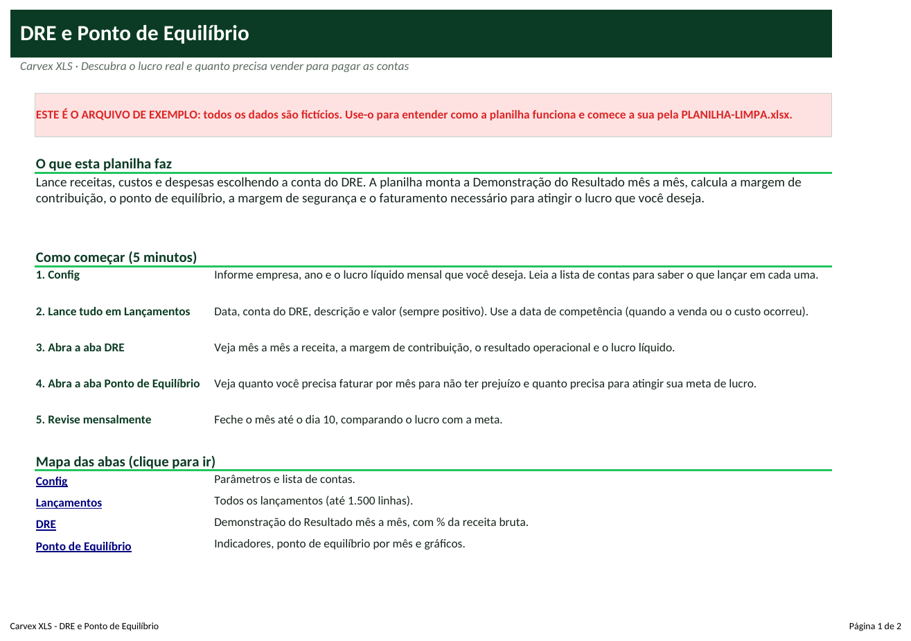
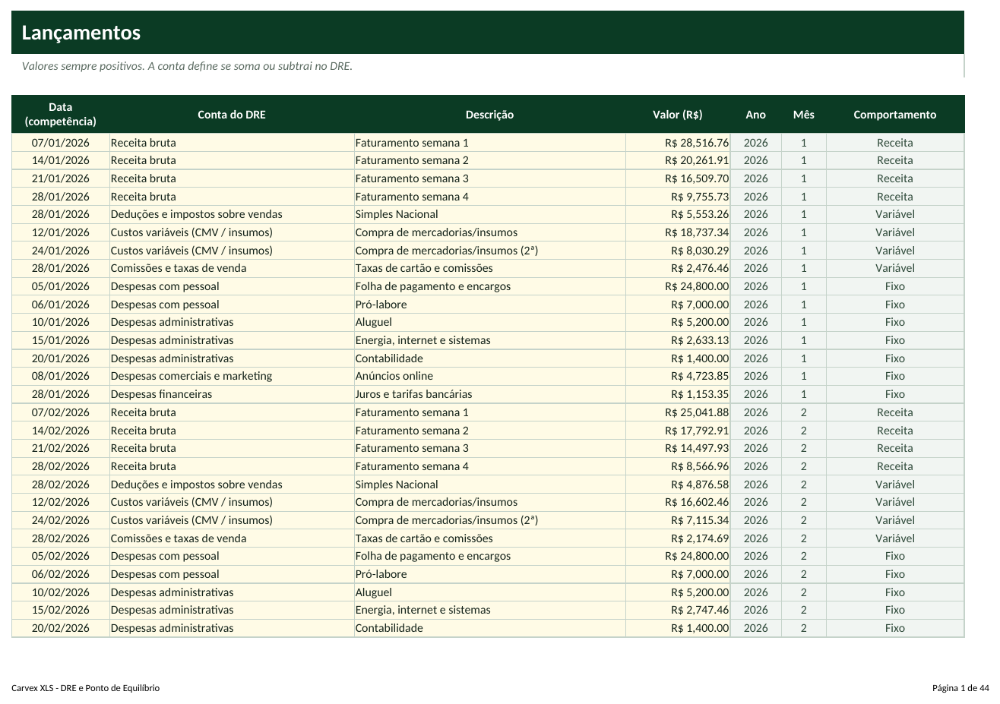
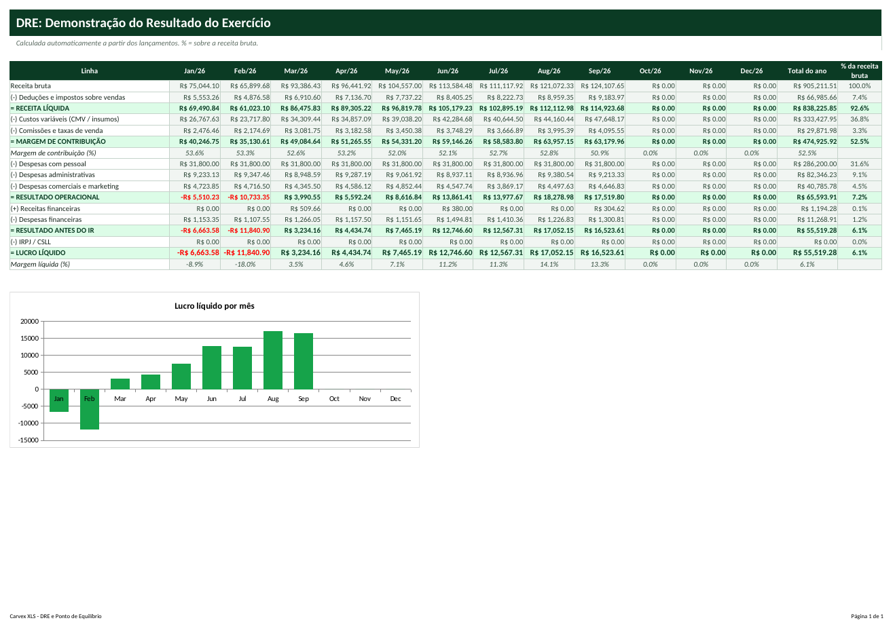

# Tutorial — DRE e Ponto de Equilíbrio

> Leia na ordem. Em 20 minutos você terá a planilha funcionando com os seus dados.

## 1. Para que serve?
- Transformar os lançamentos em um DRE (Demonstração do Resultado) mês a mês, sem fórmulas para montar.
- Calcular o ponto de equilíbrio: o faturamento mínimo para não ter prejuízo.
- Mostrar quanto precisa faturar para atingir o lucro mensal que você deseja e se você está acima ou abaixo do equilíbrio.

## 2. Para quem serve?
- Pequenas e médias empresas que só veem o lucro no balanço do contador
- Sócios e gestores iniciantes em finanças
- Lojas, indústrias leves e prestadores com custos fixos relevantes
- Empresas que querem negociar crédito com números organizados

## 3. O que você precisa antes de começar?
Separe estas informações (leva cerca de 15 minutos):
- Faturamento de cada mês (por competência: quando vendeu).
- Custos variáveis: mercadorias, insumos, comissões, taxas e impostos sobre vendas.
- Despesas fixas: folha e pró-labore, aluguel, energia, contador, marketing.
- Despesas e receitas financeiras (juros, tarifas, rendimentos).
- O lucro líquido mensal que você deseja.

## 4. Como abrir a planilha
1. Abra o arquivo **`PLANILHA-LIMPA.xlsx`** no Excel (ou LibreOffice).
2. Se aparecer a faixa amarela *Modo de Exibição Protegido*, clique em **Habilitar Edição**.
3. Clique em **Arquivo → Salvar como** e salve uma cópia com o nome da sua empresa (ex.: `DRE-MinhaEmpresa.xlsx`). **Nunca trabalhe no arquivo original**: ele é a sua cópia de segurança.
4. Na primeira aba (**Início**) leia o resumo e veja o mapa das abas (clique nos nomes para navegar).
5. Quer ver tudo funcionando antes? Abra **`EXEMPLO.xlsx`** (dados fictícios) e compare com a sua.

**Legenda de cores:** células **amarelas** = você preenche; células **cinza** = cálculo automático (não digite); cabeçalhos **verde-escuro** = títulos de coluna.

## 5. Primeiro passo — Configure o ano e a meta
1. Abra **Config**.
2. Em **C4** o nome da empresa, em **C5** o ano do DRE e em **C6** o lucro líquido mensal desejado.
3. Leia a tabela de contas (**B10:D19**) para saber o que lançar em cada uma. Não renomeie as contas.

## 6. Segundo passo — Lance as receitas, custos e despesas
1. Abra **Lançamentos** e clique em **A5**.
2. Preencha **Data** (competência), **Conta do DRE** (lista), **Descrição** e **Valor** (sempre positivo).
3. Receitas vão em 'Receita bruta' (e 'Receitas financeiras'). Todo o resto é custo ou despesa; a conta define se é fixo ou variável.
4. Dica: lance por semana ou por mês, o que for mais prático (uma linha por conta por mês já basta).

## 7. Terceiro passo — Leia o DRE e o ponto de equilíbrio
1. Abra **DRE**: cada coluna é um mês; a última é o total do ano e a coluna **% da receita bruta** mostra o peso de cada linha.
2. **Margem de contribuição** = receita líquida - custos variáveis - comissões. É o que sobra para pagar as despesas fixas.
3. Abra **Ponto de Equilíbrio**: custos fixos ÷ margem de contribuição % = faturamento mínimo.
4. A coluna **Situação** mostra 'Acima do PE' ou 'ABAIXO do PE' em cada mês.

## 8. Como interpretar os resultados
| Indicador | Como ler |
|---|---|
| **Receita líquida** | Receita bruta - deduções e impostos sobre vendas. |
| **Margem de contribuição (%)** | Quanto de cada R$ 100 vendidos sobra após custos variáveis e impostos. |
| **Resultado operacional** | O que a operação gera antes das despesas financeiras e do IR. |
| **Lucro líquido / Margem líquida** | O resultado final e quanto ele representa da receita bruta. |
| **Ponto de equilíbrio (R$)** | Custos fixos ÷ MC%. Abaixo disso há prejuízo. |
| **Margem de segurança** | Quanto a receita pode cair antes de chegar ao equilíbrio. |

## 9. Exemplo prático
Empresa fictícia com lançamentos de janeiro a setembro de 2026 (receita de cerca de R$ 66 mil a R$ 123 mil por mês) e meta de lucro de R$ 8.000,00 por mês.

- Receita bruta no ano: **R$ 905.211,51**; lucro líquido: **R$ 55.519,28** (margem líquida **6,1%**); margem de contribuição: **52,5%**.
- Ponto de equilíbrio médio: **R$ 89.074,19** por mês; margem de segurança: **11,4%**; para ter R$ 8 mil de lucro por mês é preciso faturar **R$ 104.322,24**.
- Meses acima do PE: **7**; abaixo: **2**. Os meses de início de ano ficam abaixo do equilíbrio: sazonalidade a tratar com reserva ou promoções.

*(Todos os dados do `EXEMPLO.xlsx` são fictícios e não representam pessoas ou empresas reais.)*

## 10. Como atualizar
**Diariamente**
- Nada obrigatório: o DRE é mensal.

**Semanalmente**
- Lance as notas de compra e as despesas da semana.

**Mensalmente**
- Até o dia 10: lance a receita e todas as despesas do mês anterior.
- Compare lucro líquido e margem com a meta.
- Verifique se o mês ficou acima do ponto de equilíbrio e se o custo fixo cresceu.

## 11. Erros comuns
1. Lançar pelo dia do pagamento em vez da competência
2. Misturar compra de ativo com despesa
3. Esquecer o pró-labore
4. Lançar impostos do Simples como IRPJ/CSLL
5. Meses sem receita

## 12. Como corrigir
1. **Lançar pelo dia do pagamento em vez da competência** → O DRE mostra quando a venda/gasto ocorreu. Para caixa use o Fluxo de Caixa.
2. **Misturar compra de ativo com despesa** → Compra de máquina não é despesa do mês; lance só a depreciação (se controlar) ou deixe fora e use o Fluxo de Caixa.
3. **Esquecer o pró-labore** → Sem ele o lucro parece maior. Lance em 'Despesas com pessoal'.
4. **Lançar impostos do Simples como IRPJ/CSLL** → No Simples Nacional, o DAS entra em 'Deduções e impostos sobre vendas'. IRPJ/CSLL é só para Lucro Presumido/Real.
5. **Meses sem receita** → Meses sem receita não calculam o PE (mostram vazio). Lance a receita para ver o indicador.

Se aparecer algo estranho (células vazias onde deveria haver número), confira: (a) a data de hoje na aba Config, (b) se os nomes (códigos, etapas, clientes) foram escolhidos pela lista suspensa e (c) se você digitou nas células **cinza**. Para restaurar uma fórmula apagada por engano, copie a mesma célula do `EXEMPLO.xlsx`.

## 13. Perguntas frequentes
**Substitui o DRE do contador?**  Não. É um DRE gerencial para decisão rápida; o contador entrega o oficial.

**O que é competência?**  O mês em que a venda ou o custo aconteceu, independentemente de quando foi pago.

**Posso ter mais de um ano?**  Use uma cópia da planilha para cada ano (o campo Ano da Config filtra o relatório).

**Posso detalhar mais as despesas?**  Use a coluna Descrição. As 10 contas são a estrutura fixa do DRE.

**Como interpreto margem de segurança negativa?**  Significa receita abaixo do ponto de equilíbrio: a empresa está no prejuízo operacional.
