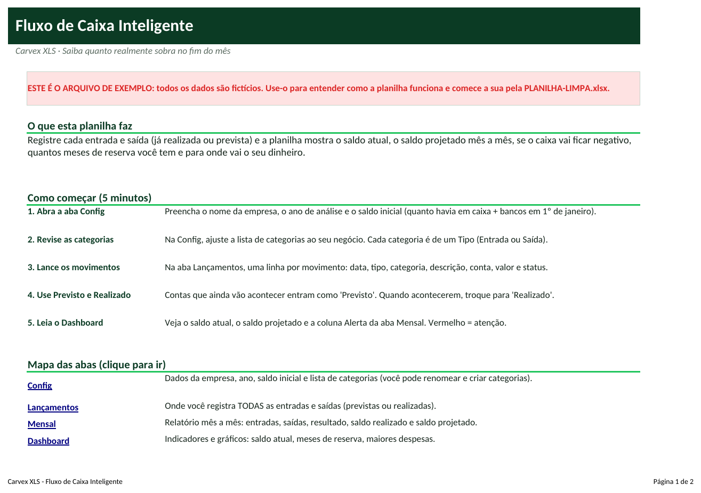
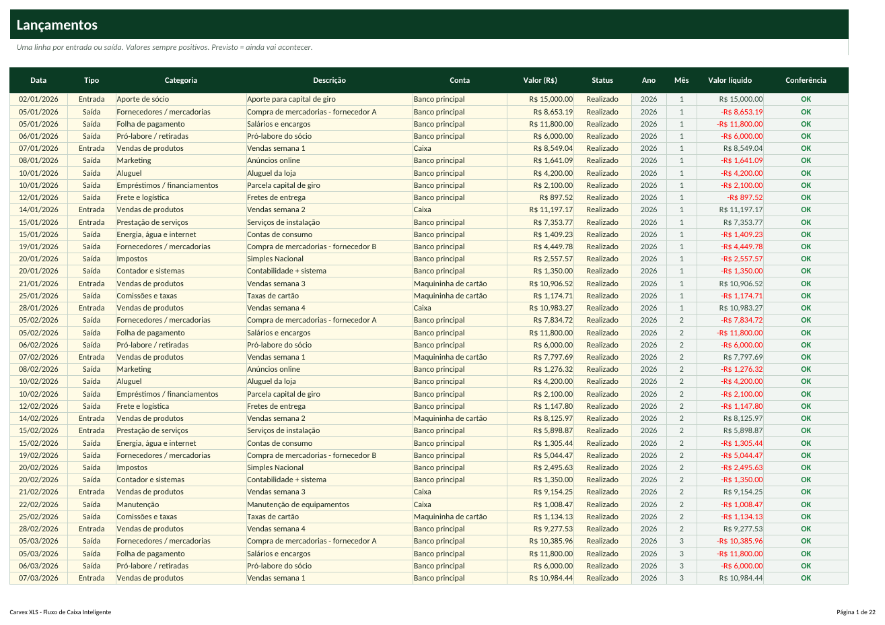
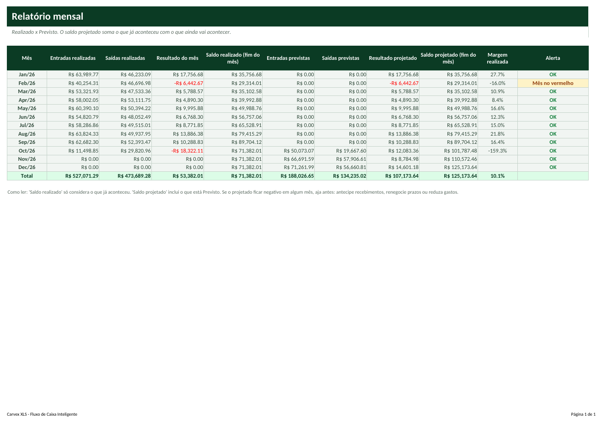

# Tutorial — Fluxo de Caixa Inteligente

> Leia na ordem. Em 20 minutos você terá a planilha funcionando com os seus dados.

## 1. Para que serve?
- Registrar todas as entradas e saídas da empresa (já realizadas ou ainda previstas) em um só lugar.
- Mostrar o saldo atual, o saldo projetado até dezembro e em qual mês o caixa pode ficar negativo.
- Dizer para onde o dinheiro está indo (maiores categorias de saída) e quantos meses de despesas você tem de reserva.

## 2. Para quem serve?
- MEIs e autônomos que querem separar pró-labore e lucro
- Lojas, restaurantes, oficinas, clínicas e escritórios pequenos
- Prestadores de serviço com receita irregular
- Qualquer empresa que hoje controla o caixa 'pelo extrato do banco'

## 3. O que você precisa antes de começar?
Separe estas informações (leva cerca de 15 minutos):
- Saldo em caixa + bancos no dia 1º de janeiro do ano (ou do dia em que vai começar).
- Extratos bancários e da maquininha do período que quer lançar.
- Lista das contas fixas (aluguel, folha, internet...) e das vendas esperadas dos próximos meses (serão lançadas como 'Previsto').
- Nome das contas que usa (Caixa, Banco, Maquininha...).

## 4. Como abrir a planilha
1. Abra o arquivo **`PLANILHA-LIMPA.xlsx`** no Excel (ou LibreOffice).
2. Se aparecer a faixa amarela *Modo de Exibição Protegido*, clique em **Habilitar Edição**.
3. Clique em **Arquivo → Salvar como** e salve uma cópia com o nome da sua empresa (ex.: `Fluxo-MinhaEmpresa.xlsx`). **Nunca trabalhe no arquivo original**: ele é a sua cópia de segurança.
4. Na primeira aba (**Início**) leia o resumo e veja o mapa das abas (clique nos nomes para navegar).
5. Quer ver tudo funcionando antes? Abra **`EXEMPLO.xlsx`** (dados fictícios) e compare com a sua.

**Legenda de cores:** células **amarelas** = você preenche; células **cinza** = cálculo automático (não digite); cabeçalhos **verde-escuro** = títulos de coluna.

## 5. Primeiro passo — Configure a empresa
1. Abra a aba **Config**.
2. Clique na célula **C4** e digite o nome da empresa.
3. Em **C5** confirme o ano. Em **C6** digite o saldo inicial (quanto havia em caixa + bancos em 1º de janeiro).
4. Em **C8** informe a meta de reserva: quantos meses de despesas você quer ter guardados (sugestão: 3).
5. Role até a tabela de categorias (**B12:D51**) e ajuste os nomes ao seu negócio. Cada categoria precisa de um **Tipo** (Entrada ou Saída).

## 6. Segundo passo — Lance as entradas e saídas
1. Abra a aba **Lançamentos** e clique na primeira linha amarela (célula **A5**).
2. Preencha, da esquerda para a direita: **Data**, **Tipo** (Entrada/Saída), **Categoria** (lista), **Descrição**, **Conta** (lista), **Valor** e **Status**.
3. Digite o valor **sempre positivo**: a planilha subtrai sozinha quando o Tipo é Saída.
4. Use **Realizado** para o que já aconteceu e **Previsto** para o que vai acontecer (conta futura, venda esperada).
5. Olhe a coluna **Conferência**: deve mostrar OK. Se mostrar 'Categoria x Tipo?', você marcou, por exemplo, 'Aluguel' como Entrada.

## 7. Terceiro passo — Entenda os cálculos
1. Abra a aba **Mensal**: cada linha é um mês do ano.
2. **Saldo realizado** = saldo inicial + resultados dos meses (só o que já aconteceu).
3. **Saldo projetado** = saldo realizado + o que está Previsto. É ele que avisa se o caixa vai ficar negativo.
4. A coluna **Alerta** mostra OK, 'Mês no vermelho' (gastou mais que recebeu) ou 'SALDO NEGATIVO'.
5. Abra o **Dashboard** para ver tudo em gráficos. Nada precisa ser digitado nessas duas abas.

## 8. Como interpretar os resultados
| Indicador | Como ler |
|---|---|
| **Saldo atual** | Dinheiro disponível hoje (saldo inicial + entradas realizadas - saídas realizadas). |
| **Resultado no ano** | Entradas - saídas realizadas. Positivo = sobrou dinheiro. |
| **Margem no ano** | Resultado ÷ entradas. Quanto sobra de cada R$ 100 que entra. |
| **Saldo projetado (dez)** | Onde o caixa termina o ano se tudo o que está Previsto acontecer. |
| **Meses de reserva** | Saldo atual ÷ média mensal de saídas. Abaixo de 1 é crítico; ideal acima da sua meta. |
| **Maiores saídas** | As 8 categorias que mais consomem dinheiro: onde cortar primeiro. |

## 9. Exemplo prático
Empresa fictícia 'Empresa Exemplo Ltda' (varejo + serviços) com saldo inicial de R$ 18.000,00 e lançamentos de janeiro a dezembro de 2026 (realizados até 08/10/2026; o resto previsto).

- Saldo atual: **R$ 71.382,01**; entradas realizadas no ano: **R$ 527.071,29**; saídas: **R$ 473.689,28**; resultado: **R$ 53.382,01** (margem de **10,1%**).
- Meses de reserva: **1,5** → situação: **Abaixo da meta** (a meta configurada é 3 meses). Saldo projetado em dezembro: **R$ 125.173,64**.
- Leitura: a empresa fatura bem, mas o fornecedor e a folha consomem mais da metade das saídas e a reserva está curta; o caminho é renegociar compras e formar reserva.

*(Todos os dados do `EXEMPLO.xlsx` são fictícios e não representam pessoas ou empresas reais.)*

## 10. Como atualizar
**Diariamente**
- Lance as vendas e pagamentos do dia (ou do dia anterior).
- Troque para 'Realizado' o que foi pago/recebido.

**Semanalmente**
- Confira o saldo do Dashboard com o saldo do banco; se divergir, procure lançamento faltando.
- Lance as contas previstas das próximas semanas.

**Mensalmente**
- Feche o mês: veja Resultado e Margem na aba Mensal.
- Compare as 3 maiores saídas com o mês anterior.
- Revise a meta de reserva.

## 11. Erros comuns
1. Digitar valor negativo nas saídas
2. Deixar tudo como 'Realizado'
3. Categoria incompatível com o Tipo
4. Esquecer o saldo inicial
5. Alterar o ano e esperar dados antigos
6. Escrever datas como texto

## 12. Como corrigir
1. **Digitar valor negativo nas saídas** → A planilha já subtrai as saídas. Digite sempre valores positivos (a validação bloqueia negativos).
2. **Deixar tudo como 'Realizado'** → Contas futuras devem ser 'Previsto', senão o saldo projetado e o alerta ficam errados.
3. **Categoria incompatível com o Tipo** → A coluna Conferência mostra 'Categoria x Tipo?'. Corrija o Tipo ou a categoria.
4. **Esquecer o saldo inicial** → Sem ele o saldo fica errado. Preencha Config!C6 com o saldo de 1º de janeiro.
5. **Alterar o ano e esperar dados antigos** → O ano da Config filtra todo o relatório. Para outro ano, use uma cópia da planilha limpa.
6. **Escrever datas como texto** → Use dd/mm/aaaa. Datas inválidas são recusadas pela validação.

Se aparecer algo estranho (células vazias onde deveria haver número), confira: (a) a data de hoje na aba Config, (b) se os nomes (códigos, etapas, clientes) foram escolhidos pela lista suspensa e (c) se você digitou nas células **cinza**. Para restaurar uma fórmula apagada por engano, copie a mesma célula do `EXEMPLO.xlsx`.

## 13. Perguntas frequentes
**Posso usar no Google Sheets?**  Sim, mas recomendamos Excel (ou LibreOffice). No Google Sheets alguns formatos de gráfico podem mudar; os cálculos funcionam.

**Quantos lançamentos cabem?**  1.000 linhas por ano (mais que suficiente para a maioria das pequenas empresas). Para mais, use uma cópia por semestre.

**Posso ter mais de uma conta bancária?**  Sim. Cadastre as contas em Config (F12:F23) e escolha em cada lançamento. O saldo é o total de todas.

**E o pró-labore do dono?**  Há a categoria 'Pró-labore / retiradas'. Lance como Saída; assim você separa o salário do dono do lucro da empresa.

**A planilha emite nota fiscal ou concilia banco?**  Não. Ela é um controle gerencial: você lança manualmente e confere com o extrato.
