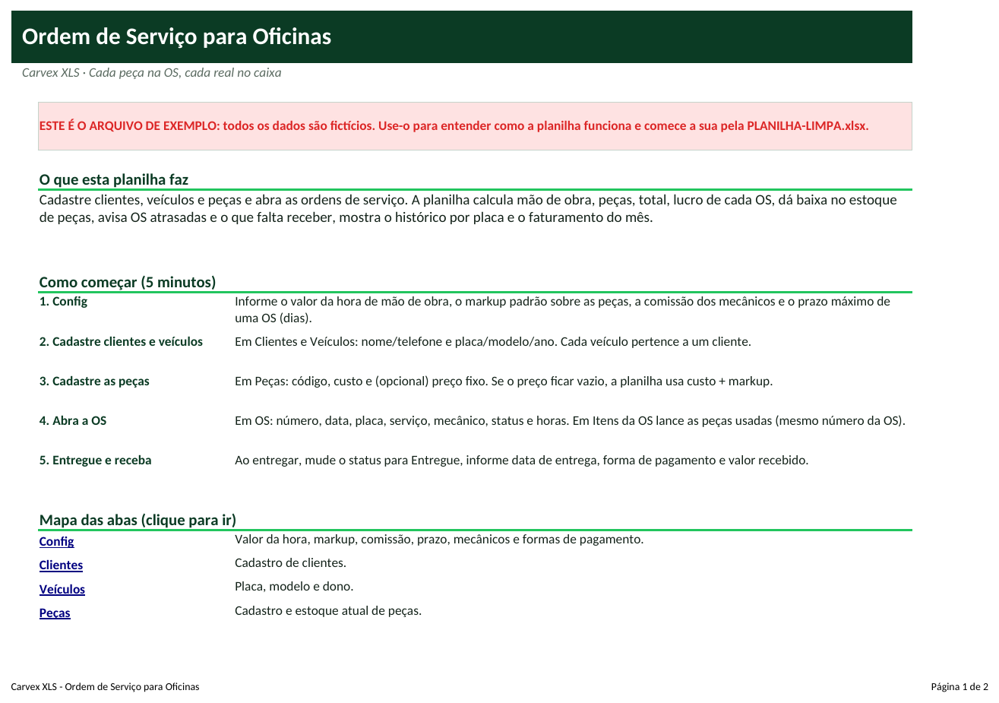
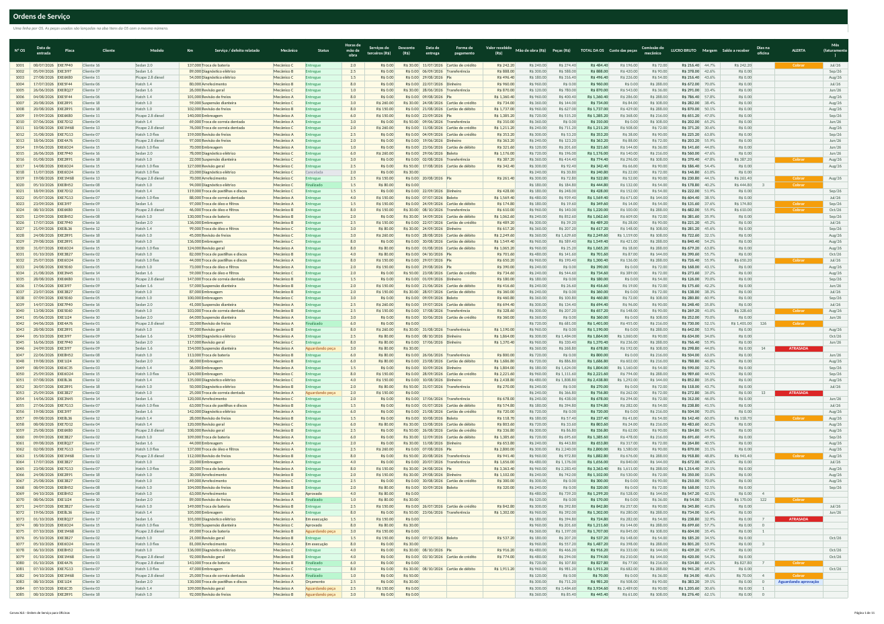
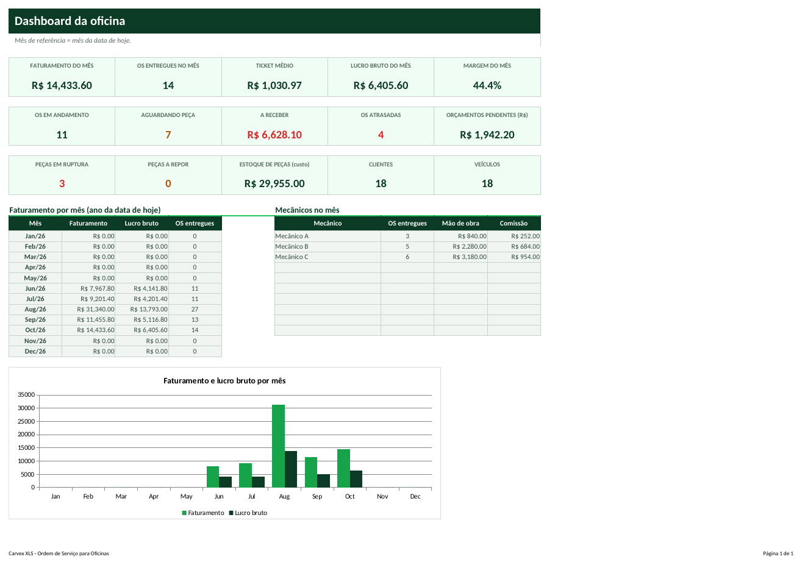

# Tutorial — Ordem de Serviço para Oficinas

> Leia na ordem. Em 20 minutos você terá a planilha funcionando com os seus dados.

## 1. Para que serve?
- Abrir e acompanhar ordens de serviço com mão de obra, peças e terceiros.
- Dar baixa automática no estoque de peças e avisar o que está em ruptura.
- Mostrar lucro por OS, quanto falta receber, OS atrasadas e o faturamento do mês.

## 2. Para quem serve?
- Oficinas mecânicas e auto centers
- Auto elétricas e funilarias
- Retíficas e oficinas de motos
- Qualquer oficina que ainda usa talão e caderno

## 3. O que você precisa antes de começar?
Separe estas informações (leva cerca de 15 minutos):
- Valor da hora de mão de obra e percentual de comissão dos mecânicos.
- Lista de peças com custo e (opcional) preço de venda.
- Estoque atual das peças principais.
- Lista de clientes e veículos (nome, placa, modelo).

## 4. Como abrir a planilha
1. Abra o arquivo **`PLANILHA-LIMPA.xlsx`** no Excel (ou LibreOffice).
2. Se aparecer a faixa amarela *Modo de Exibição Protegido*, clique em **Habilitar Edição**.
3. Clique em **Arquivo → Salvar como** e salve uma cópia com o nome da sua empresa (ex.: `Ordem-MinhaEmpresa.xlsx`). **Nunca trabalhe no arquivo original**: ele é a sua cópia de segurança.
4. Na primeira aba (**Início**) leia o resumo e veja o mapa das abas (clique nos nomes para navegar).
5. Quer ver tudo funcionando antes? Abra **`EXEMPLO.xlsx`** (dados fictícios) e compare com a sua.

**Legenda de cores:** células **amarelas** = você preenche; células **cinza** = cálculo automático (não digite); cabeçalhos **verde-escuro** = títulos de coluna.

## 5. Primeiro passo — Configure a oficina
1. Abra **Config**: **C6** valor da hora de mão de obra, **C7** markup padrão sobre peças (ex.: 40%), **C8** comissão dos mecânicos sobre a mão de obra, **C9** prazo máximo de uma OS aberta (dias).
2. Cadastre os mecânicos em **E5:E14** e as formas de pagamento em **G5:G14**.
3. Cadastre **Clientes**, **Veículos** (placa única e cliente) e **Peças** (código, descrição, custo, estoque inicial e mínimo; preço fixo é opcional).

## 6. Segundo passo — Abra a OS e lance as peças
1. Abra **OS**. Em uma linha nova: **Nº OS** (único), **Data de entrada**, **Placa** (lista), **Km**, **Serviço**, **Mecânico**, **Status** e **Horas de mão de obra**.
2. Abra **Itens da OS** e, para cada peça usada, informe o **Nº OS**, o **Código da peça** e a **Quantidade**. O preço vem da tabela de peças (ou digite outro).
3. Mude o status ao longo do serviço: Orçamento → Aprovado → Em execução → Aguardando peça → Finalizado → Entregue.
4. O estoque só baixa quando o status sai de 'Orçamento' (e não é 'Cancelada').

## 7. Terceiro passo — Entregue, receba e acompanhe
1. Ao entregar, mude para **Entregue** e preencha **Data de entrega**, **Forma de pagamento** e **Valor recebido**.
2. A OS calcula **TOTAL**, **Custo das peças**, **Comissão**, **LUCRO BRUTO**, **Margem** e **Saldo a receber**; a coluna **ALERTA** mostra ATRASADA ou Cobrar.
3. Abra **Histórico**, escolha a placa em **C4** e veja todas as OS dela. O **Dashboard** mostra faturamento do mês, ticket médio, lucro, OS atrasadas e peças em ruptura.

## 8. Como interpretar os resultados
| Indicador | Como ler |
|---|---|
| **Total da OS** | Mão de obra + peças + terceiros - desconto. |
| **Lucro bruto** | Total - custo das peças - comissão do mecânico - terceiros. |
| **Margem** | Lucro bruto ÷ total da OS. |
| **Saldo a receber** | OS finalizada/entregue com valor recebido menor que o total. |
| **OS atrasadas** | Aprovadas/em execução/aguardando peça há mais dias que o prazo. |
| **Estoque de peças** | Situação RUPTURA / REPOR / OK pelo estoque mínimo. |

## 9. Exemplo prático
Oficina fictícia com 18 clientes, 24 peças e 96 ordens de serviço entre junho e outubro de 2026.

- Faturamento do mês: **R$ 14.433,60** com **14** OS entregues (ticket médio **R$ 1.030,97**); lucro bruto **R$ 6.405,60** (margem **44,4%**).
- OS em andamento: **11**, sendo **7** aguardando peça e **4** atrasadas; a receber: **R$ 6.628,10**.
- Peças em ruptura: **3**; estoque de peças ao custo: **R$ 29.955,00**.

*(Todos os dados do `EXEMPLO.xlsx` são fictícios e não representam pessoas ou empresas reais.)*

## 10. Como atualizar
**Diariamente**
- Abra as OS do dia e atualize status.
- Lance as peças usadas e as entregas com valor recebido.

**Semanalmente**
- Revise OS ATRASADAS e 'Aguardando peça'.
- Cobre os clientes com status Cobrar.

**Mensalmente**
- Veja faturamento, lucro e comissão por mecânico.
- Reponha as peças em RUPTURA/REPOR.
- Atualize o valor da hora e o markup se necessário.

## 11. Erros comuns
1. Usar Nº de OS repetido
2. Lançar peças sem Nº de OS correto
3. Esquecer de mudar o status para Entregue
4. Placa não cadastrada
5. Peça sem custo cadastrado

## 12. Como corrigir
1. **Usar Nº de OS repetido** → A validação bloqueia repetição. Cada OS tem um número único.
2. **Lançar peças sem Nº de OS correto** → A coluna Conferência de Itens da OS mostra 'OS inexistente'. Corrija o número.
3. **Esquecer de mudar o status para Entregue** → O faturamento do mês só considera OS Entregue com data de entrega.
4. **Placa não cadastrada** → Cadastre o veículo antes (aba Veículos) para o cliente e o modelo aparecerem.
5. **Peça sem custo cadastrado** → Sem custo o lucro fica inflado. Preencha o custo das peças.

Se aparecer algo estranho (células vazias onde deveria haver número), confira: (a) a data de hoje na aba Config, (b) se os nomes (códigos, etapas, clientes) foram escolhidos pela lista suspensa e (c) se você digitou nas células **cinza**. Para restaurar uma fórmula apagada por engano, copie a mesma célula do `EXEMPLO.xlsx`.

## 13. Perguntas frequentes
**Emite nota fiscal?**  Não. A planilha controla a operação; a emissão é feita no seu sistema fiscal.

**Posso mudar o texto dos status?**  Os status são fixos para que os cálculos funcionem.

**Como funciona o preço das peças?**  Se o preço fixo estiver vazio, usa custo + markup da Config.

**A comissão incide sobre peças?**  Não: só sobre a mão de obra (percentual da Config).

**Quantas OS cabem?**  1.000 OS, 3.000 itens, 500 peças, 300 clientes e veículos.
