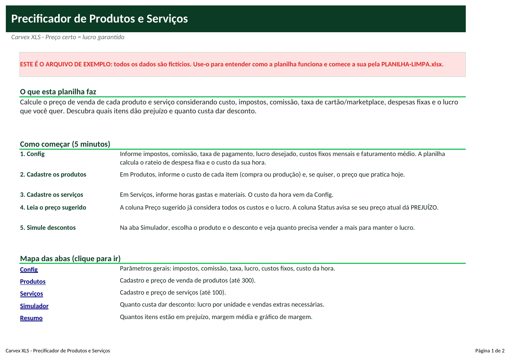
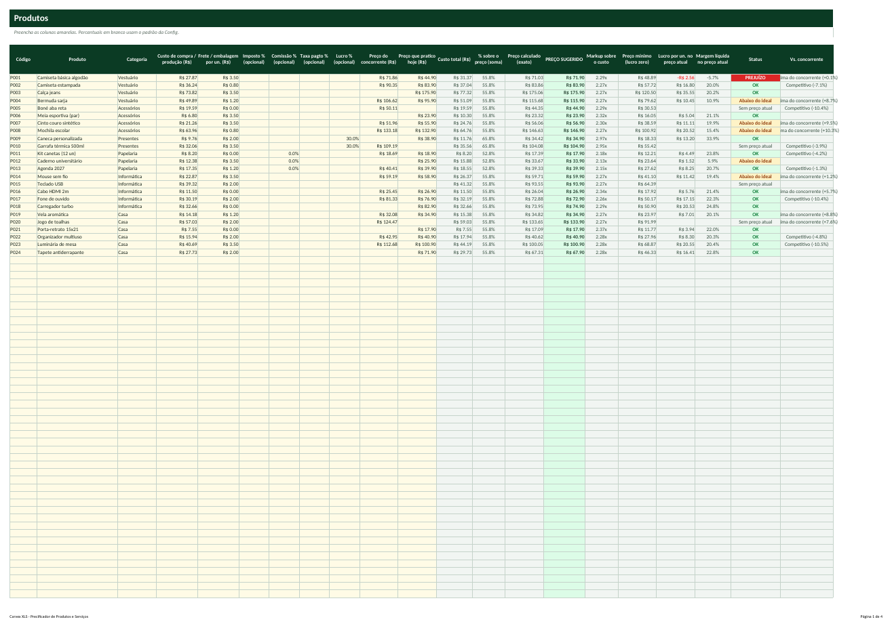
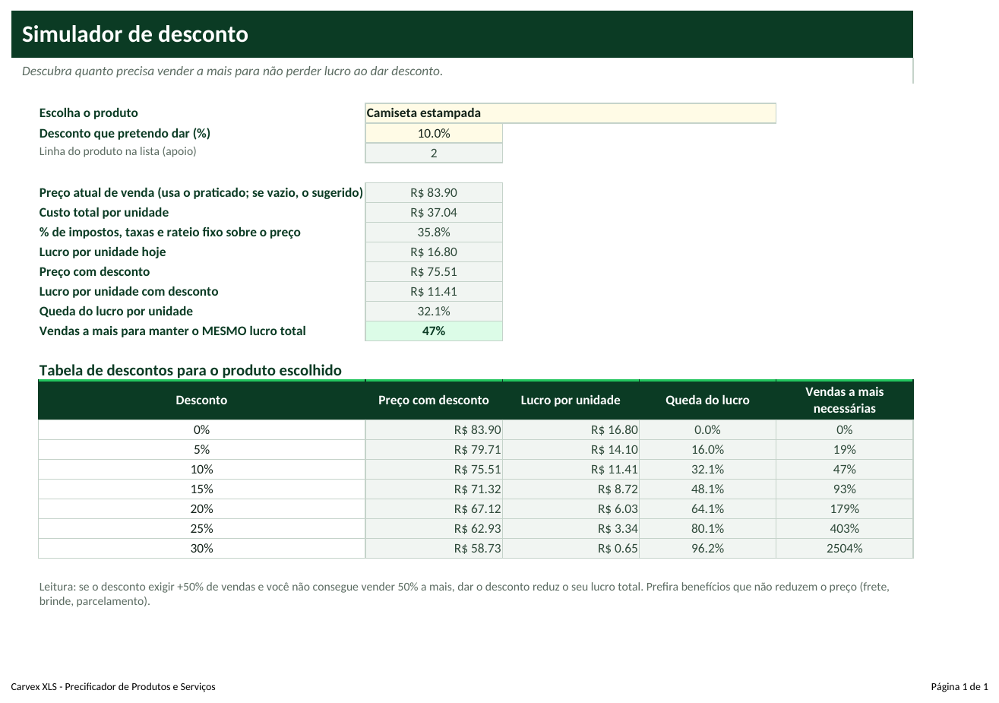

# Tutorial — Precificador de Produtos e Serviços

> Leia na ordem. Em 20 minutos você terá a planilha funcionando com os seus dados.

## 1. Para que serve?
- Calcular o preço de cada produto e serviço para garantir o lucro que você quer, depois de pagar impostos, comissão, taxa de cartão e as despesas fixas.
- Mostrar quais itens vendidos hoje dão prejuízo ou estão abaixo do ideal.
- Simular descontos: quanto cai o lucro e quanto você precisa vender a mais para compensar.

## 2. Para quem serve?
- Lojas e e-commerce
- Prestadores de serviço (instalação, manutenção, consultoria)
- Confeiteiras, artesãos e pequenas indústrias
- MEIs e autônomos que cobram 'no olho'

## 3. O que você precisa antes de começar?
Separe estas informações (leva cerca de 15 minutos):
- Custo de compra ou produção de cada produto (e frete/embalagem por unidade).
- Percentual médio de impostos sobre a venda (pergunte ao contador).
- Comissão paga a vendedores e taxa média de cartão/marketplace.
- Soma dos custos fixos mensais (aluguel, salários, energia...) e o faturamento médio mensal.
- Para serviços: pró-labore desejado e horas realmente vendáveis por mês.

## 4. Como abrir a planilha
1. Abra o arquivo **`PLANILHA-LIMPA.xlsx`** no Excel (ou LibreOffice).
2. Se aparecer a faixa amarela *Modo de Exibição Protegido*, clique em **Habilitar Edição**.
3. Clique em **Arquivo → Salvar como** e salve uma cópia com o nome da sua empresa (ex.: `Precificador-MinhaEmpresa.xlsx`). **Nunca trabalhe no arquivo original**: ele é a sua cópia de segurança.
4. Na primeira aba (**Início**) leia o resumo e veja o mapa das abas (clique nos nomes para navegar).
5. Quer ver tudo funcionando antes? Abra **`EXEMPLO.xlsx`** (dados fictícios) e compare com a sua.

**Legenda de cores:** células **amarelas** = você preenche; células **cinza** = cálculo automático (não digite); cabeçalhos **verde-escuro** = títulos de coluna.

## 5. Primeiro passo — Preencha a Config
1. Abra a aba **Config**.
2. Em **C6** digite o imposto sobre vendas (ex.: 6%). Em **C7** a comissão. Em **C8** a taxa de pagamento/plataforma. Em **C9** o lucro líquido desejado (ex.: 20%).
3. Em **C12** informe os custos fixos mensais e em **C13** o faturamento médio mensal. A planilha calcula o rateio de despesa fixa em **C14**.
4. Para serviços: **C17** pró-labore desejado e **C18** horas produtivas por mês. O custo da hora aparece em **C19**.

## 6. Segundo passo — Cadastre produtos e serviços
1. Abra **Produtos** e preencha nas colunas amarelas: Código, Produto, Categoria, **Custo de compra/produção** e **Frete/embalagem**.
2. Percentuais específicos (imposto, comissão, taxa, lucro) são opcionais: **deixe em branco para usar o padrão** da Config; digite 0% se o item não tem aquele custo.
3. Se já vende o produto, digite o **Preço que pratico hoje** (coluna K) para ver margem e status. Opcional: preço do concorrente (J).
4. Em **Serviços**, informe horas gastas, materiais e deslocamento; o custo da mão de obra vem do custo da hora.

## 7. Terceiro passo — Leia o preço e simule descontos
1. Em **Produtos**, a coluna **PREÇO SUGERIDO** (verde) é o preço que garante o lucro desejado. **Preço mínimo** é o menor preço com lucro zero.
2. A coluna **Status** mostra PREJUÍZO, Abaixo do ideal ou OK conforme o preço que você pratica.
3. Abra **Simulador**, escolha o produto em **C4** e digite o desconto em **C5**.
4. Veja o lucro por unidade antes e depois e a linha **Vendas a mais para manter o MESMO lucro total**. Abra o **Resumo** para o panorama.

## 8. Como interpretar os resultados
| Indicador | Como ler |
|---|---|
| **Preço calculado** | Custo total ÷ (1 - soma dos percentuais). É o preço exato. |
| **Preço sugerido** | Preço calculado arredondado para terminar em ,90 (preço psicológico). |
| **Markup** | Preço sugerido ÷ custo. Quantas vezes o custo é multiplicado. |
| **Margem líquida no preço atual** | Quanto sobra de lucro por R$ 100 vendidos ao preço que pratica. |
| **Status** | PREJUÍZO = lucro negativo; Abaixo do ideal = lucra, mas menos que o desejado; OK = bate a meta. |
| **Vendas a mais necessárias** | Quanto precisa vender além do atual para ter o mesmo lucro total depois de dar desconto. |

## 9. Exemplo prático
Loja fictícia com imposto de 6%, comissão de 3%, taxa de 3,5%, lucro desejado de 20% e rateio de despesa fixa de 23,3% (custos fixos de R$ 14 mil sobre faturamento de R$ 60 mil). Os 24 produtos do exemplo mostram o status de cada preço.

- Itens cadastrados: **24**; em prejuízo: **1**; abaixo do ideal: **5**; com preço OK: **14**. Margem média atual: **19,0%** (desejada: 20,0%).
- Primeiro produto: preço exato **R$ 71,03**, sugerido **R$ 71,90**. Custo da hora dos serviços: **R$ 158,33**.
- Simulador (produto **Camiseta estampada**, desconto de 10%): lucro por unidade cai de **R$ 16,80** para **R$ 11,41**; é preciso vender **47,2%** a mais para manter o lucro total.

*(Todos os dados do `EXEMPLO.xlsx` são fictícios e não representam pessoas ou empresas reais.)*

## 10. Como atualizar
**Diariamente**
- Nada obrigatório. Use ao precificar um item novo ou ao negociar um desconto.

**Semanalmente**
- Atualize o preço de compra dos itens que mudaram de fornecedor.
- Revise os itens com status PREJUÍZO.

**Mensalmente**
- Atualize custos fixos e faturamento médio na Config (o rateio muda).
- Reveja impostos e taxas.
- Compare os preços sugeridos com a concorrência.

## 11. Erros comuns
1. Usar percentuais sobre o custo em vez de sobre o preço
2. Esquecer de incluir o frete e a embalagem
3. Aparecer 'Revisar %'
4. Colocar o faturamento errado na Config
5. Digitar 0 achando que é 'padrão'

## 12. Como corrigir
1. **Usar percentuais sobre o custo em vez de sobre o preço** → Todos os percentuais são sobre o PREÇO DE VENDA. Se seu imposto é 6% do faturamento, digite 6%.
2. **Esquecer de incluir o frete e a embalagem** → Preencha a coluna 'Frete/embalagem por un.' para o custo total ficar correto.
3. **Aparecer 'Revisar %'** → A soma dos percentuais chegou a 100% ou mais; reduza custos fixos, lucro desejado ou taxas.
4. **Colocar o faturamento errado na Config** → Se o faturamento for menor que o real, o rateio fixo fica alto demais e os preços sobem; use a média dos últimos 6 meses.
5. **Digitar 0 achando que é 'padrão'** → Em branco = usa o padrão. Digitar 0% = o item não tem esse custo.

Se aparecer algo estranho (células vazias onde deveria haver número), confira: (a) a data de hoje na aba Config, (b) se os nomes (códigos, etapas, clientes) foram escolhidos pela lista suspensa e (c) se você digitou nas células **cinza**. Para restaurar uma fórmula apagada por engano, copie a mesma célula do `EXEMPLO.xlsx`.

## 13. Perguntas frequentes
**Qual a diferença entre markup e margem?**  Markup é sobre o custo (preço ÷ custo - 1). Margem é sobre o preço (lucro ÷ preço). A planilha mostra os dois.

**Serve para vender em marketplace?**  Sim: use a Taxa de pagamento/plataforma como a comissão do marketplace e coloque o frete subsidiado na coluna de frete/embalagem. Uma versão premium com tabelas por canal está no roadmap.

**Preciso saber contabilidade?**  Não. O Tutorial explica cada campo e o contador informa o percentual de impostos.

**Como calcular o custo da hora?**  A planilha calcula: (custos fixos + pró-labore) ÷ horas produtivas por mês.

**Posso mudar o arredondamento do preço?**  O preço sugerido termina em ,90. Se preferir outro, use o preço calculado (coluna N) como base.
