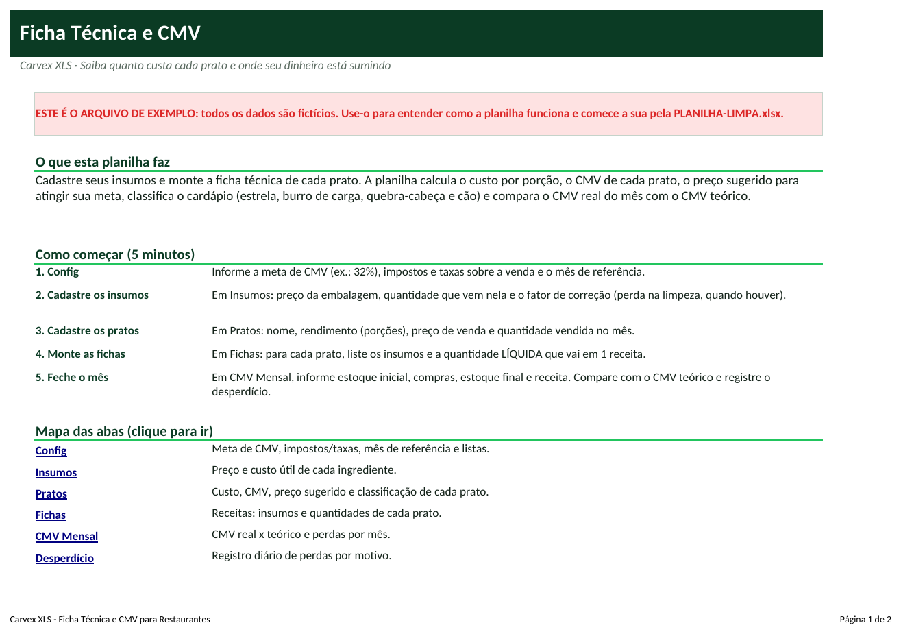
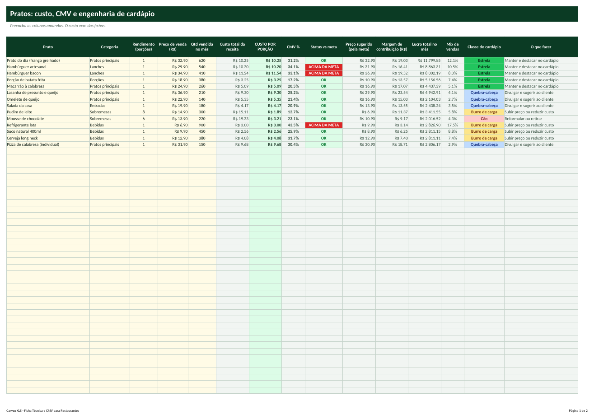
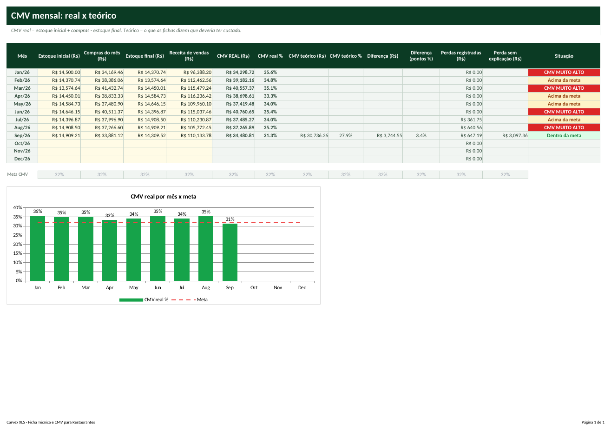

# Tutorial — Ficha Técnica e CMV para Restaurantes

> Leia na ordem. Em 20 minutos você terá a planilha funcionando com os seus dados.

## 1. Para que serve?
- Calcular o custo exato de cada prato (por porção) e o CMV de cada item do cardápio.
- Descobrir quais pratos estão acima da meta, quais são 'estrela' e quais deveriam sair do cardápio.
- Comparar o CMV real do mês (estoque + compras) com o CMV teórico das fichas e registrar o desperdício.

## 2. Para quem serve?
- Restaurantes, bares e lanchonetes
- Pizzarias, hamburguerias e padarias
- Confeitarias e marmitarias
- Dark kitchens e delivery

## 3. O que você precisa antes de começar?
Separe estas informações (leva cerca de 15 minutos):
- Lista de insumos com preço e quantidade da embalagem (nota fiscal de compra).
- Receitas dos pratos com a quantidade líquida de cada ingrediente.
- Preço de venda e quantidade vendida de cada prato no mês.
- Estoque inicial, compras e estoque final do mês em R$ (contagem física).
- Faturamento do mês.

## 4. Como abrir a planilha
1. Abra o arquivo **`PLANILHA-LIMPA.xlsx`** no Excel (ou LibreOffice).
2. Se aparecer a faixa amarela *Modo de Exibição Protegido*, clique em **Habilitar Edição**.
3. Clique em **Arquivo → Salvar como** e salve uma cópia com o nome da sua empresa (ex.: `Ficha-MinhaEmpresa.xlsx`). **Nunca trabalhe no arquivo original**: ele é a sua cópia de segurança.
4. Na primeira aba (**Início**) leia o resumo e veja o mapa das abas (clique nos nomes para navegar).
5. Quer ver tudo funcionando antes? Abra **`EXEMPLO.xlsx`** (dados fictícios) e compare com a sua.

**Legenda de cores:** células **amarelas** = você preenche; células **cinza** = cálculo automático (não digite); cabeçalhos **verde-escuro** = títulos de coluna.

## 5. Primeiro passo — Configure e cadastre os insumos
1. Abra **Config**: **C5** meta de CMV (ex.: 32%), **C6** impostos+taxas sobre a venda, **C7** mês de referência (1º dia do mês, ex.: 01/09/2026) e **C8** o ano.
2. Abra **Insumos** e preencha: **Insumo**, **Unidade**, **Preço da embalagem**, **Qtd na embalagem** e **Fator de correção** (1 se não há perda).
3. O custo por unidade útil é calculado: custo por unidade bruto x fator de correção.

## 6. Segundo passo — Cadastre os pratos e monte as fichas
1. Abra **Pratos**: **Prato**, **Categoria**, **Rendimento** (porções que a receita rende), **Preço de venda** e **Qtd vendida no mês**.
2. Abra **Fichas**: em cada linha escolha o **Prato**, o **Insumo** e a **Quantidade líquida** usada em 1 receita, na unidade do insumo (0,150 para 150 g quando a unidade é kg).
3. Veja em **Pratos** o **CUSTO POR PORÇÃO**, o **CMV %** e o **Status vs meta**. A coluna *Preço sugerido* mostra o preço necessário para atingir a meta.

## 7. Terceiro passo — Feche o mês e registre o desperdício
1. Abra **CMV Mensal** e, na linha do mês, preencha **Estoque inicial**, **Compras**, **Estoque final** e **Receita de vendas** (R$).
2. A planilha calcula o **CMV real** e, no mês de referência, o **CMV teórico** (quantidades vendidas x custo das fichas).
3. A **Diferença** mostra quanto foi perdido além do esperado; **Perdas registradas** vem da aba **Desperdício** (data, insumo, quantidade, motivo); o restante é *Perda sem explicação*.
4. O **Dashboard** mostra os 5 piores pratos, a engenharia de cardápio e as perdas por motivo.

## 8. Como interpretar os resultados
| Indicador | Como ler |
|---|---|
| **Custo por porção** | Soma do custo útil dos insumos ÷ rendimento. |
| **CMV % do prato** | Custo por porção ÷ preço de venda. |
| **Classe do cardápio** | Estrela (vende e lucra), Burro de carga (vende, margem baixa), Quebra-cabeça (lucra, vende pouco), Cão (nem vende nem lucra). |
| **CMV real x teórico** | Real = (estoque inicial + compras - estoque final) ÷ receita. Teórico = o que as fichas dizem. A diferença são perdas. |
| **Perda sem explicação** | Diferença que não está registrada como desperdício: investigar (furto, porção maior, erro de contagem). |

## 9. Exemplo prático
Restaurante fictício com 26 insumos, 14 pratos e fichas completas; mês de referência: setembro de 2026; meta de CMV de 32%.

- CMV real: **31,3%** x CMV teórico: **27,9%** (meta **32,0%**). Diferença de **3,4** pontos percentuais acima do esperado.
- Perdas registradas no mês: **R$ 647,19**; perda sem explicação: **R$ 3.097,36**. Pratos acima da meta: **3**; pratos Estrela: **5**; Cães: **1**.
- Margem de contribuição do mês no cardápio: **R$ 64.427,88**. O prato com pior CMV é **Refrigerante lata**.

*(Todos os dados do `EXEMPLO.xlsx` são fictícios e não representam pessoas ou empresas reais.)*

## 10. Como atualizar
**Diariamente**
- Registre qualquer desperdício na aba Desperdício (data, insumo, quantidade, motivo).
- Atualize o preço do insumo quando chegar nota fiscal com valor novo.

**Semanalmente**
- Revise o preço de compra dos insumos mais usados.
- Veja os pratos com status ACIMA DA META.

**Mensalmente**
- No 1º dia do mês, faça a contagem física do estoque.
- Preencha CMV Mensal e a quantidade vendida de cada prato.
- Decida: manter Estrelas, reprecificar Burros de carga, divulgar Quebra-cabeças e reformular Cães.

## 11. Erros comuns
1. Quantidade na ficha em unidade diferente do insumo
2. Esquecer o fator de correção
3. Rendimento errado
4. Esquecer de lançar a quantidade vendida
5. Estoque final estimado

## 12. Como corrigir
1. **Quantidade na ficha em unidade diferente do insumo** → Se o insumo está em kg, a ficha usa kg (0,150 e não 150). A coluna Unidade da ficha mostra a unidade esperada.
2. **Esquecer o fator de correção** → Sem FC o custo do prato fica menor que o real (ex.: carnes, legumes). Use bruto ÷ líquido.
3. **Rendimento errado** → Se a receita rende 4 porções, informe 4 no Rendimento; senão o custo por porção fica 4x maior.
4. **Esquecer de lançar a quantidade vendida** → Sem ela não há classe do cardápio nem CMV teórico.
5. **Estoque final estimado** → Faça contagem física; estimativa distorce o CMV real.

Se aparecer algo estranho (células vazias onde deveria haver número), confira: (a) a data de hoje na aba Config, (b) se os nomes (códigos, etapas, clientes) foram escolhidos pela lista suspensa e (c) se você digitou nas células **cinza**. Para restaurar uma fórmula apagada por engano, copie a mesma célula do `EXEMPLO.xlsx`.

## 13. Perguntas frequentes
**O que é fator de correção?**  É a relação bruto ÷ líquido. Se 1 kg de frango rende 870 g limpos, FC = 1,15.

**Qual CMV é ideal?**  Depende do tipo de restaurante; referências de mercado citam entre 25% e 40%. Defina sua meta na Config.

**Posso usar para delivery?**  Sim: cadastre o preço do delivery como outro prato ou ajuste o preço de venda; a versão premium terá margem por plataforma.

**E bebidas e produtos prontos?**  Cadastre como insumo e prato com 1 ingrediente (veja Refrigerante lata no exemplo).

**Quantos pratos e insumos?**  100 pratos, 300 insumos, 800 linhas de ficha e 500 registros de desperdício.
