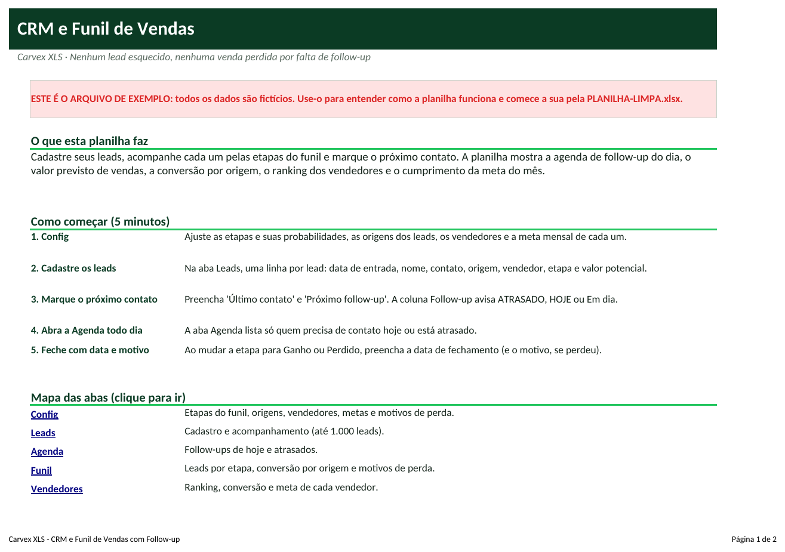
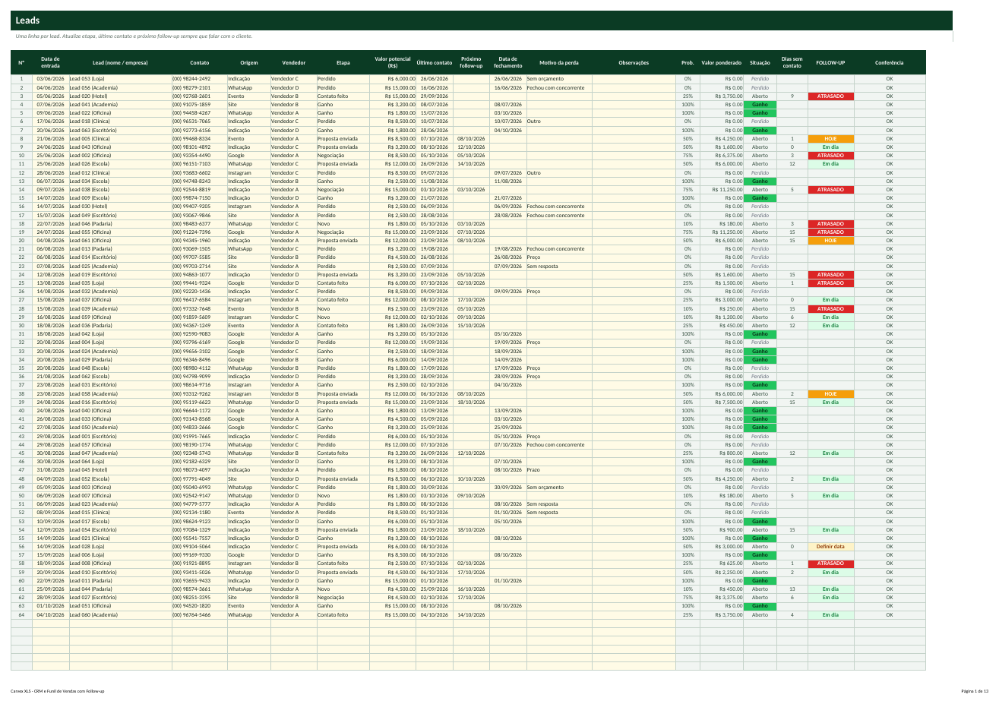
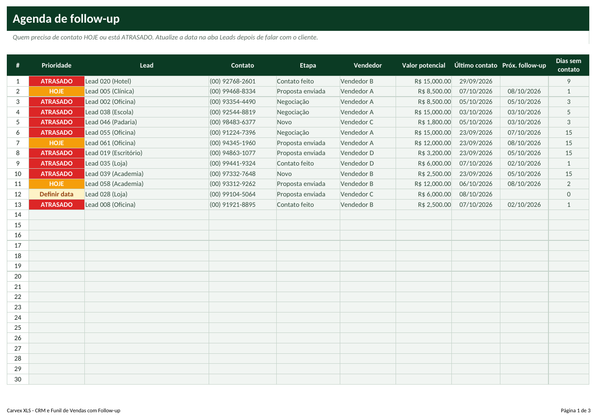

# Tutorial — CRM e Funil de Vendas com Follow-up

> Leia na ordem. Em 20 minutos você terá a planilha funcionando com os seus dados.

## 1. Para que serve?
- Cadastrar leads e acompanhá-los por etapa do funil até ganhar ou perder.
- Mostrar todo dia quem precisa de contato (hoje ou atrasado) para não deixar nenhuma venda esfriar.
- Prever vendas (valor ponderado pela probabilidade) e medir conversão por origem e por vendedor.

## 2. Para quem serve?
- Equipes comerciais pequenas
- Consultores, corretores e prestadores de serviço
- Lojas e agências com vendas consultivas
- Donos que vendem pelo WhatsApp

## 3. O que você precisa antes de começar?
Separe estas informações (leva cerca de 15 minutos):
- Lista dos leads atuais (nome, contato, origem, valor potencial, etapa).
- Lista de vendedores e a meta mensal de cada um.
- Suas etapas de venda (padrão: Novo, Contato feito, Proposta enviada, Negociação).
- Origens dos leads (indicação, Instagram, Google...).

## 4. Como abrir a planilha
1. Abra o arquivo **`PLANILHA-LIMPA.xlsx`** no Excel (ou LibreOffice).
2. Se aparecer a faixa amarela *Modo de Exibição Protegido*, clique em **Habilitar Edição**.
3. Clique em **Arquivo → Salvar como** e salve uma cópia com o nome da sua empresa (ex.: `CRM-MinhaEmpresa.xlsx`). **Nunca trabalhe no arquivo original**: ele é a sua cópia de segurança.
4. Na primeira aba (**Início**) leia o resumo e veja o mapa das abas (clique nos nomes para navegar).
5. Quer ver tudo funcionando antes? Abra **`EXEMPLO.xlsx`** (dados fictícios) e compare com a sua.

**Legenda de cores:** células **amarelas** = você preenche; células **cinza** = cálculo automático (não digite); cabeçalhos **verde-escuro** = títulos de coluna.

## 5. Primeiro passo — Configure o funil e a equipe
1. Abra **Config**. Em **B10:C15** ajuste as etapas e a **probabilidade** de fechamento de cada uma (não renomeie *Ganho* e *Perdido*).
2. Cadastre origens (**E5:E14**), vendedores e **meta mensal** (**G5:H14**) e motivos de perda (**J5:J14**).
3. Em **C6** defina quantos dias sem contato geram alerta.

## 6. Segundo passo — Cadastre e atualize os leads
1. Abra **Leads**. Em cada linha: **Data de entrada**, **Lead**, **Contato**, **Origem**, **Vendedor**, **Etapa** e **Valor potencial**.
2. Sempre que falar com o lead, atualize **Último contato** e **Próximo follow-up** (a data em que vai procurá-lo).
3. Ao fechar, mude a **Etapa** para Ganho ou Perdido e preencha **Data de fechamento** (e **Motivo da perda**).
4. A coluna **FOLLOW-UP** mostra ATRASADO, HOJE, Em dia ou Definir data.

## 7. Terceiro passo — Trabalhe pela Agenda e leia os relatórios
1. Todo dia abra a aba **Agenda**: ela lista só quem está ATRASADO, é HOJE ou está sem data definida.
2. Abra **Funil** para ver leads por etapa, **conversão por origem** e motivos de perda.
3. Abra **Vendedores** para o ranking e % da meta do mês. O **Dashboard** reúne previsão ponderada, vendido no mês, conversão e ticket médio.

## 8. Como interpretar os resultados
| Indicador | Como ler |
|---|---|
| **Valor ponderado** | Valor potencial x probabilidade da etapa. Previsão realista do que deve fechar. |
| **Conversão** | Ganhos ÷ (ganhos + perdidos). |
| **Ticket médio** | Valor médio das vendas ganhas. |
| **Ciclo médio de venda** | Dias entre a entrada do lead e o fechamento das vendas ganhas. |
| **% da meta** | Vendido no mês ÷ meta do vendedor. |
| **Follow-ups atrasados** | Leads abertos com próximo contato vencido. |

## 9. Exemplo prático
Consultoria fictícia com 64 leads e 4 vendedores (Vendedor A a D), metas mensais de R$ 78 mil no total; data de hoje 08/10/2026.

- Leads em aberto: **27** (**R$ 207.800,00**); previsão ponderada: **R$ 91.735,00**; vendido no mês: **R$ 64.700,00** (**82,9%** da meta).
- Conversão: **48,6%**; ticket médio: **R$ 4.838,89**; ciclo médio: **36,3** dias; follow-ups atrasados: **9**.
- Leitura: na aba Funil compare a conversão de cada origem para decidir onde investir, e zere os follow-ups atrasados da Agenda antes de buscar novos leads.

*(Todos os dados do `EXEMPLO.xlsx` são fictícios e não representam pessoas ou empresas reais.)*

## 10. Como atualizar
**Diariamente**
- Abra a Agenda e faça os contatos de HOJE e ATRASADOS.
- Atualize Último contato e Próximo follow-up de cada lead trabalhado.

**Semanalmente**
- Revise leads em 'Proposta enviada' e 'Negociação' parados há mais de 7 dias.
- Veja o ranking de vendedores.

**Mensalmente**
- Feche o mês: vendido x meta; conversão por origem.
- Analise os motivos de perda e ajuste a oferta.
- Atualize as metas.

## 11. Erros comuns
1. Não preencher o próximo follow-up
2. Ganhar um lead sem data de fechamento
3. Renomear Ganho/Perdido
4. Valor potencial vazio
5. Vendedor fora da lista

## 12. Como corrigir
1. **Não preencher o próximo follow-up** → Sem data, o lead aparece como 'Definir data' ou ATRASADO. Sempre agende o próximo contato.
2. **Ganhar um lead sem data de fechamento** → A venda não entra no relatório do mês. Preencha a data de fechamento (a coluna Conferência avisa).
3. **Renomear Ganho/Perdido** → A planilha usa esses nomes nos cálculos. Renomeie só as outras etapas.
4. **Valor potencial vazio** → A previsão ponderada fica zerada. Estime sempre um valor.
5. **Vendedor fora da lista** → Use a lista suspensa; o ranking considera só os vendedores da Config.

Se aparecer algo estranho (células vazias onde deveria haver número), confira: (a) a data de hoje na aba Config, (b) se os nomes (códigos, etapas, clientes) foram escolhidos pela lista suspensa e (c) se você digitou nas células **cinza**. Para restaurar uma fórmula apagada por engano, copie a mesma célula do `EXEMPLO.xlsx`.

## 13. Perguntas frequentes
**Substitui um CRM com WhatsApp integrado?**  Não integra com WhatsApp. É ideal para quem quer organizar o funil sem mensalidade.

**Posso ter mais etapas?**  Há 6 etapas na Config (4 abertas + Ganho + Perdido). Você pode renomear as 4 abertas.

**Quantos leads cabem?**  1.000. Mantenha uma cópia por ano.

**A probabilidade é automática?**  Não: você define em Config. Ajuste com o seu histórico de fechamento.

**Posso usar em equipe?**  Sim, em uma pasta compartilhada (Drive, OneDrive); cuide para dois usuários não editarem ao mesmo tempo em arquivo local.
